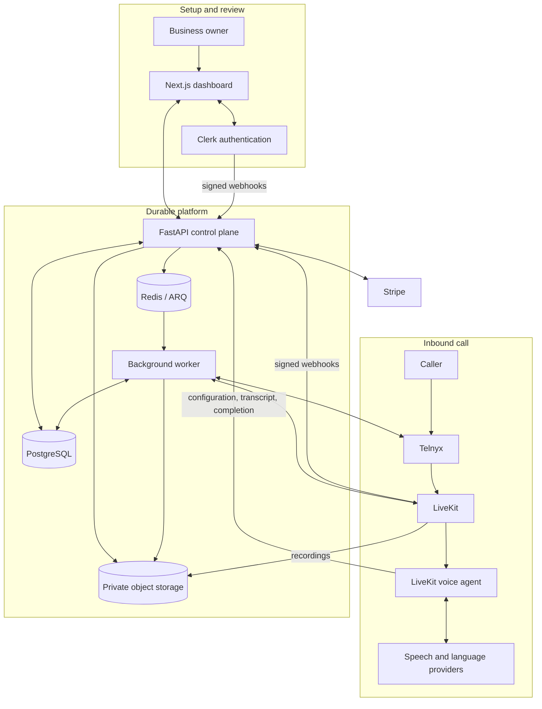

# Presvo (WIP)

> An open-source, France-first AI voice assistant for handling inbound business calls.

**Status:** Working MVP in active development. Locally verified, but not yet production-certified.


## What Presvo does

Presvo gives professionals and small businesses a configurable AI receptionist and a dedicated French phone number. It can:

- answer conditionally forwarded calls with business-specific context;
- manage subscriptions, number setup, forwarding verification, and live-call monitoring;
- preserve transcripts, summaries, private recordings, and minute usage;
- provide a responsive dashboard for reviewing calls and configuring the assistant.

## Project progress

### Done

- Public landing page, authentication shell, and tenant-isolated dashboard
- Resumable local activation journey with fake billing and telephony providers
- Stripe billing and queued Telnyx number-provisioning integrations
- LiveKit voice-agent runtime with configurable speech and language providers
- Durable call lifecycle, transcripts, summaries, private recordings, and usage accounting
- Account deactivation/reactivation and owner-controlled terminal-call removal

### In progress

- Fresh real-provider certification across Clerk, Stripe, Telnyx, and LiveKit
- Cloud deployment, monitoring, backup restoration, and recovery evidence
- Call tags and notes, accessibility conformance, and frontend performance gates

### Planned

- French localization plus approved legal, privacy, retention, and support pages
- Account export, permanent deletion, and automatic retention
- Conversation-flow builder, tools, human transfer, and reusable subflows
- Calendar, CRM, and appointment-booking integrations
- Live monitoring and intervention plus production push delivery
- Additional countries and subscription plans after the France-first launch

See [Project Status and Roadmap](docs/PROJECT_STATUS.md) for the complete, evidence-based feature matrix and production gates.

## Architecture



The owner journey configures and reviews the service through the dashboard. The
call journey routes an inbound phone call through Telnyx and LiveKit to the
voice agent, which persists durable results through the API for later review.

## Run locally

### Prerequisites

- Docker with Docker Compose
- Node.js 22 only when running browser tests from the host

Start the provider-free development stack from the repository root:

```bash
docker compose -f compose.dev.yaml up --build postgres redis minio minio-init migrate api worker web
```

Open [http://127.0.0.1:3000/activate](http://127.0.0.1:3000/activate).
This path uses local identity and fake billing, carrier, telephony, and
verification providers, so hosted credentials are not required. It does not
start the LiveKit voice agent.

Run the disposable browser proof with:

```bash
npm exec --prefix apps/web -- playwright install chromium
bash scripts/run-local-e2e.sh
```

For real-provider configuration, follow the
[staging smoke runbook](docs/architecture/staging-smoke-runbook.md).

## Technology

| Area | Technology |
|---|---|
| Web | Next.js 16, React 19, TypeScript, Tailwind CSS 4, shadcn/ui |
| API | Python 3.13, FastAPI, SQLAlchemy, Alembic, Pydantic |
| Voice | LiveKit Agents, Speechmatics/Deepgram, Gemini, Speechmatics/ElevenLabs |
| Providers | Clerk, Stripe, Telnyx |
| Data and jobs | PostgreSQL, Redis, ARQ, S3-compatible object storage |
| Delivery | Docker Compose, GitHub Actions, OpenTelemetry, gitleaks, Trivy |

## Documentation

- [Detailed project status and roadmap](docs/PROJECT_STATUS.md)
- [Architecture and engineering context](docs/architecture/backend-context.md)
- [Integration endpoints](docs/architecture/integration-endpoints.md)
- [Contributing guide](CONTRIBUTING.md)
- [Security policy](SECURITY.md)

Presvo is available under the [MIT License](LICENSE).
