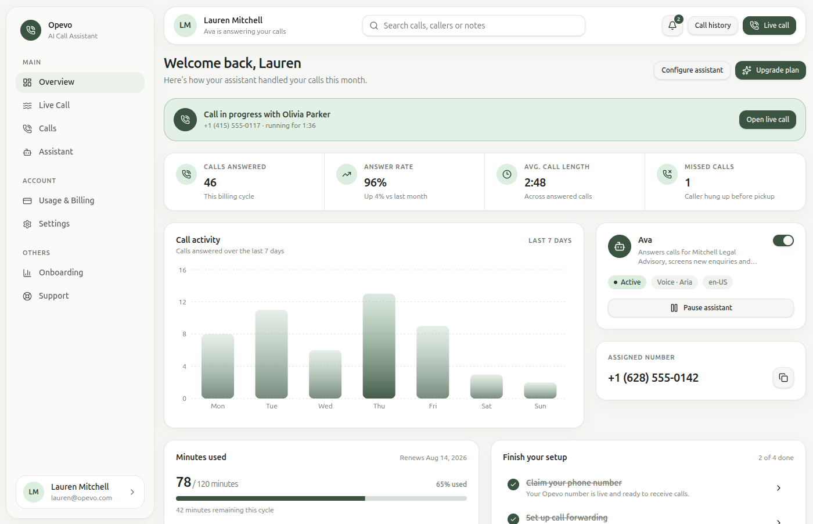
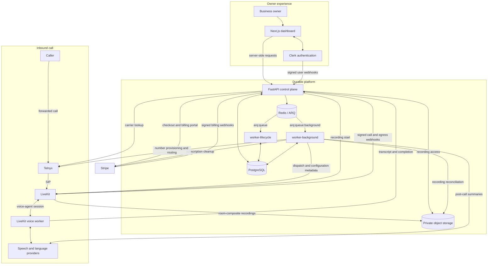

# Opevo (WIP)

> An open-source, France-first AI voice assistant for handling inbound business calls.

**Status:** Working MVP in active development. Locally verified, but not yet production-certified.



## What Opevo does

Opevo gives professionals and small businesses a configurable AI receptionist and a dedicated French phone number. It can:

- answer conditionally forwarded calls with business-specific context;
- manage subscriptions, number setup, forwarding verification, and live-call monitoring;
- preserve transcripts, summaries, private recordings, and minute usage;
- provide a responsive dashboard for reviewing calls and configuring the assistant.

## Project progress

### Done

- Public landing page, authentication shell, and tenant-isolated dashboard
- Clerk-authenticated local activation journey with fake billing and telephony providers
- Stripe billing and queued Telnyx number-provisioning integrations
- LiveKit voice-agent runtime with configurable speech and language providers
- Durable call lifecycle, transcripts, summaries, private recordings, and usage accounting
- Account deactivation/reactivation and owner-controlled terminal-call removal

### In progress

- Fresh real-provider certification across Clerk, Stripe, Telnyx, and LiveKit
- Cloud deployment, monitoring, backup restoration, and recovery evidence
- Call tags and notes, accessibility conformance, and frontend performance gates

### Planned

- French localization plus approved legal, privacy, retention, and support pages
- Account export, permanent deletion, and automatic retention
- Conversation-flow builder, tools, human transfer, and reusable subflows
- Calendar, CRM, and appointment-booking integrations
- Live monitoring and intervention plus production push delivery
- Additional countries and subscription plans after the France-first launch

See [Project Status and Roadmap](docs/PROJECT_STATUS.md) for the complete, evidence-based feature matrix and production gates.

## Architecture

The checked-in application is organized around these code and runtime
boundaries:

| Path | Responsibility |
|---|---|
| `apps/web` | Next.js dashboard. Server Components and Server Actions obtain a Clerk token and call FastAPI server-side. |
| `apps/api` | FastAPI control plane, provider webhooks, domain services, repositories, provider adapters, SQLAlchemy models, and Alembic migrations. |
| `apps/api/app/workers` | Two ARQ entry points built from the API image: the call-lifecycle worker and the background/outbox worker. |
| `apps/agent` | LiveKit voice worker. It consumes dispatch metadata, builds the configured speech pipeline, streams transcript segments to FastAPI, and reports call completion. |
| `libs/shared` | Versioned Pydantic wire contracts shared by FastAPI and the voice worker for dispatch, transcript, completion, and optional realtime events. |


The owner journey is server-rendered by Next.js: the web app obtains the Clerk
session token, calls FastAPI, and renders PostgreSQL-backed state. Clerk and
Stripe also synchronize identity and billing state through signed webhooks.

For an inbound call, Telnyx forwards SIP media to LiveKit. A signed LiveKit
participant webhook makes FastAPI validate eligibility and atomically commit a
pending call plus a `livekit.dispatch` outbox event. `worker-background` reads a
fresh PostgreSQL snapshot, puts the receptionist configuration and a scoped
agent token into the shared dispatch contract, and asks LiveKit to dispatch the
voice worker. The worker therefore receives configuration from LiveKit job
metadata; it does not fetch configuration from FastAPI.

During the call, the voice worker posts ordered transcript segments and the
completion request to FastAPI. FastAPI first commits transcript recovery and
call-end facts, then acknowledges completion after enqueueing
`worker-lifecycle`. That worker finalizes call state and usage in PostgreSQL and
records reference-only post-call outbox intents. `worker-background` then
handles provider work such as summaries, number lifecycle, account cleanup,
dispatch reconciliation, and recording reconciliation. LiveKit writes mixed
room recordings directly to private object storage; recording bytes do not pass
through FastAPI or the voice worker.

### Worker ownership

`worker-lifecycle` consumes `arq:queue` for call finalization and call
reconciliation (default 10 slots). `worker-background` consumes
`arq:queue:background` for outbox delivery/reconciliation and verification
expiry (default 4 slots). PostgreSQL outbox/call state is authoritative. For
durable workflows, Redis is the execution and wakeup path; when optional
realtime is explicitly enabled, Redis also carries non-authoritative observer
events. Missed workflow wakeups are recovered from PostgreSQL by reconciliation.
Operational rollout, recovery, and the bounded local/CI isolation evidence are
recorded in the
[deployment runbook](docs/runbooks/deploy.md).
That evidence holds four background slots while ten lifecycle probes start
simultaneously, with local/CI queue-delay p95 `<= 2 seconds`; it is not
production certification.

## Run locally

### Prerequisites

- Docker with Docker Compose
- Node.js 22 only when running browser tests from the host

Configure Clerk credentials in `apps/web/.env` and the API verifier credentials
in `apps/api/.env` (see the [staging smoke runbook](docs/architecture/staging-smoke-runbook.md)).
Then start the standard Clerk-authenticated development stack from the repository
root:

```bash
docker compose -f compose.dev.yaml up --build postgres redis minio minio-init migrate api worker-lifecycle worker-background web
```

Open [http://127.0.0.1:3000/activate](http://127.0.0.1:3000/activate).
This uses Clerk for identity. The fake billing, carrier, telephony, and
verification providers are separate from authentication; they do not create a
synthetic user. It does not start the LiveKit voice agent.

For a manual, provider-free local-auth test only, explicitly opt in to the
development token:

```bash
AUTH_MODE=local \
LOCAL_AUTH_TOKEN=replace-with-a-development-only-token \
docker compose -f compose.dev.yaml up --build postgres redis minio minio-init migrate api worker-lifecycle worker-background web
```

For disposable CI-equivalent proof, run the isolated provider-free browser
suite. The script explicitly selects local authentication and owns isolation,
credentials, ports, and cleanup:

```bash
npm exec --prefix apps/web -- playwright install chromium
bash scripts/run-local-e2e.sh
```

For real-provider configuration, follow the
[staging smoke runbook](docs/architecture/staging-smoke-runbook.md).

## Technology

| Area | Technology |
|---|---|
| Web | Next.js 16, React 19, TypeScript, Tailwind CSS 4, shadcn/ui |
| API | Python 3.13, FastAPI, SQLAlchemy, Alembic, Pydantic |
| Voice | LiveKit Agents, Speechmatics/Deepgram, Gemini, Speechmatics/ElevenLabs |
| Providers | Clerk, Stripe, Telnyx |
| Data and jobs | PostgreSQL, Redis, ARQ, S3-compatible object storage |
| Delivery | Docker Compose, GitHub Actions, OpenTelemetry, gitleaks, Trivy |

## Documentation

- [Detailed project status and roadmap](docs/PROJECT_STATUS.md)
- [Architecture and runtime contract](docs/architecture/runtime-contract.md)
- [Integration endpoints](docs/architecture/integration-endpoints.md)
- [Contributing guide](CONTRIBUTING.md)
- [Security policy](SECURITY.md)

Opevo is available under the [MIT License](LICENSE).
