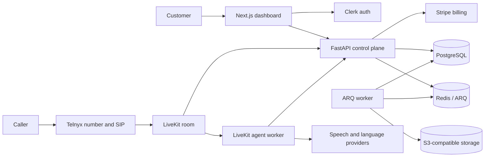

# Presvo

> An open-source, France-first AI voice assistant platform for handling inbound
> business calls.

**Status:** Active development. Presvo is a working pre-production MVP with a
production-oriented architecture. Work is progressing toward a controlled
beta, with onboarding, compliance, recovery testing, and real-provider
certification still in progress.


## What Presvo does

Presvo gives a professional or small business a dedicated French phone number
and a configurable AI assistant. Inbound calls are routed through Telnyx and
LiveKit, handled by a separate voice-agent worker, and made reviewable in a
Next.js dashboard with transcripts, summaries, recordings, and minute usage.

### Implemented capabilities

- Clerk-authenticated, tenant-isolated customer dashboard
- Stripe-hosted checkout, billing portal, subscription lifecycle, and
  authoritative minute accounting
- Queue-backed France number provisioning with visible progress and retry
- Configurable agent identity, instructions, business context, and knowledge
- LiveKit inbound dispatch with STT → Gemini → TTS voice processing
- Incremental transcript persistence and crash-recovery tail
- Durable call state machine, reconciliation, call limits, and idempotent
  finalization
- Structured summaries, private recordings, signed playback access, and call
  archive
- Transactional outbox for provider operations and post-call work
- Readiness checks, safe logging, OpenTelemetry, security scans, and hardened
  container definitions

## Current scope and limitations

The public MVP is intentionally constrained to France, one `starter` plan, one
agent per customer, inbound calls, and the `stt_llm_tts` launch pipeline.

The current dashboard exposes onboarding state and a setup checklist, but not
yet a complete guided onboarding wizard. Real-provider staging certification,
French legal and localization work, recovery drills, account data lifecycle,
and controlled-beta evidence are also still in progress.

See [Project Status and Roadmap](docs/PROJECT_STATUS.md) for the evidence-based
feature matrix, production gates, and planned conversation-flow work.

## Architecture



### Inbound call lifecycle

1. Stripe-backed onboarding provisions a French Telnyx number.
2. An inbound SIP caller joins a LiveKit room.
3. A verified LiveKit webhook creates the durable call and dispatches the
   customer-scoped agent.
4. The agent loads the customer's configuration, speaks the required AI and
   recording disclosure, and handles the call.
5. Transcript segments are persisted incrementally with call-scoped JWT
   authorization.
6. Call completion is reconciled through PostgreSQL state transitions and
   transactional outbox work for usage, summary, recording, notification, and
   routing effects.
7. The dashboard reads the durable call, transcript, summary, recording, and
   billing state from the API.

## Engineering highlights

- **Authoritative billing:** minute grants and call debits are serialized in
  PostgreSQL with database-enforced idempotency.
- **Durable calls:** transcripts are appended during the call, finalization is
  retryable, and stale calls are reconciled through an explicit state machine.
- **Safe provider effects:** provisioning, dispatch, recording, summaries,
  notifications, usage, and routing intent use transactional outbox delivery.
- **Scoped agent access:** every call receives a short-lived dispatch JWT bound
  to its user, agent configuration, and call.
- **Privacy-aware operations:** sensitive values are redacted, recordings stay
  private, and signed access is minted only for authorized call owners.
- **Release discipline:** CI covers linting, type checks, tests, migrations,
  dependency audits, full-history secret scanning, and container scanning.

## Technology stack

| Area | Technology |
|---|---|
| Web | Next.js 16, React 19, TypeScript, Tailwind CSS 4, shadcn/ui, Clerk |
| API | Python 3.13, FastAPI, SQLAlchemy, Alembic, Pydantic |
| Voice runtime | LiveKit Agents, Speechmatics/Deepgram, Gemini, Speechmatics/ElevenLabs |
| Telephony and billing | Telnyx, Stripe |
| Data and jobs | PostgreSQL, Redis, ARQ, S3-compatible object storage |
| Operations | Docker Compose, OpenTelemetry, GitHub Actions, gitleaks, Trivy, Dependabot |

## Local development

### Prerequisites

- Docker with Docker Compose
- Hosted provider credentials only if you want to exercise authentication,
  billing, provisioning, or live voice calls

### Start the core stack

From the repository root:

```bash
docker compose -f compose.dev.yaml up --build
```

This starts PostgreSQL 17, Redis 7, MinIO, the one-shot migration service,
FastAPI, the ARQ worker, and Next.js. The web application is available at
`http://localhost:3000`; without Clerk configuration it shows setup notices
instead of authenticated customer data.

Local ignored environment files can be created from:

- `apps/api/.env.example`
- `apps/agent/.env.example`
- `apps/web/.env.example`

### Add the live voice worker

After configuring LiveKit and the selected speech/model providers in
`apps/agent/.env`:

```bash
docker compose -f compose.dev.yaml --profile voice up --build
```

A real end-to-end phone call also requires valid Clerk, Stripe, Telnyx,
LiveKit, storage, and model-provider configuration. Follow the
[staging smoke runbook](docs/architecture/staging-smoke-runbook.md) for that
path.

For per-application verification commands, see
[CONTRIBUTING.md](CONTRIBUTING.md).

## Repository structure

```text
apps/
├── api/       FastAPI control plane, webhooks, persistence, and workers
├── agent/     LiveKit voice-agent runtime
└── web/       Next.js landing page and customer dashboard
docs/
├── architecture/  Current contracts and deployment decisions
├── runbooks/      Deployment, rollback, incident, and credential procedures
├── security/      Reviewed dependency exceptions
└── superpowers/   Historical design specifications and implementation plans
infra/             Storage lifecycle configuration
libs/shared/       Small cross-application Python contracts
```

## Documentation

- [Project status and roadmap](docs/PROJECT_STATUS.md)
- [Backend context](docs/architecture/backend-context.md)
- [Integration endpoints](docs/architecture/integration-endpoints.md)
- [Production deployment decision](docs/architecture/production-deployment.md)
- [Staging smoke runbook](docs/architecture/staging-smoke-runbook.md)
- [Deployment runbook](docs/runbooks/deploy.md)
- [Rollback runbook](docs/runbooks/rollback.md)
- [Incident response](docs/runbooks/incident-response.md)
- [Dependency exceptions](docs/security/dependency-exceptions.md)

## Contributing and security

Contributions are welcome. Read [CONTRIBUTING.md](CONTRIBUTING.md) before
starting a change. Please report vulnerabilities privately according to
[SECURITY.md](SECURITY.md).

## License

Presvo is available under the [MIT License](LICENSE).
