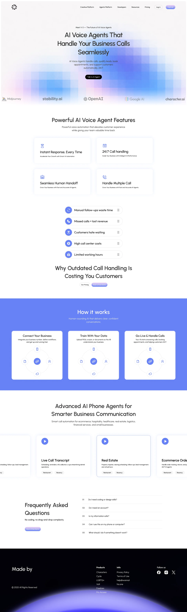
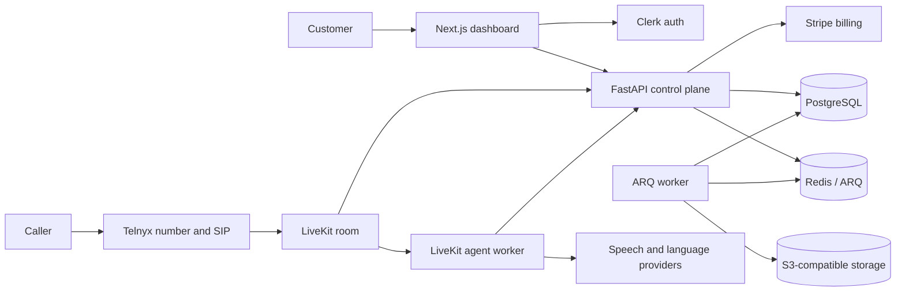

# Presvo

> An open-source, France-first AI voice assistant platform for handling inbound
> business calls.

**Status:** Active development; production-oriented and locally verified, not
production-certified.

Presvo is a working MVP with a production-oriented architecture. The complete
guided activation journey and durable recording lifecycle are implemented and
locally verified. Cloud deployment, compliance approval, recovery testing, and
real-provider certification are still required before a controlled beta.



## What Presvo does

Presvo gives a professional or small business a dedicated French phone number
and a configurable AI assistant. Inbound calls are routed through Telnyx and
LiveKit, handled by a separate voice-agent worker, and made reviewable in a
Next.js dashboard with transcripts, summaries, recordings, and minute usage.

### Implemented capabilities

- Clerk-authenticated, tenant-isolated customer dashboard
- Stripe-hosted checkout, billing portal, subscription lifecycle, and
  authoritative minute accounting
- Queue-backed France number provisioning with visible progress and retry
- Resumable five-milestone activation for business profile, receptionist,
  number, conditional forwarding, verification, and explicit go-live
- Configurable agent identity, instructions, business context, and knowledge
- LiveKit inbound dispatch with STT → Gemini → TTS voice processing
- Incremental transcript persistence and crash-recovery tail
- Durable call state machine, reconciliation, call limits, and idempotent
  finalization
- Structured summaries, private recordings, signed playback access, and
  owner-controlled removal of terminal calls
- Transactional outbox for provider operations and post-call work
- Readiness checks, safe logging, OpenTelemetry, security scans, and hardened
  container definitions

## Current scope and limitations

The public MVP is intentionally constrained to France, one `starter` plan, one
agent per customer, inbound calls, and the `stt_llm_tts` launch pipeline.

The guided journey is complete for the local provider-free mode. The launch
market remains professionals and small businesses in France, using an English
UI and a Presvo-provided French number reached through conditional forwarding
for unanswered, busy, and unreachable calls. Real-provider staging
certification, French legal/localization work, recovery drills, and
controlled-beta evidence remain in progress.

An authenticated owner can use **Remove call** on a terminal call. One local
transaction purges customer call content, hides the call, and returns `204`
without waiting for LiveKit or storage. When a private recording operation or
legacy recording metadata exists, that transaction also records stop/deletion
intent and reference-only reconciliation work. Non-exhausting asynchronous
cleanup then makes any provider recording non-running and removes the original
audio from active storage. Repeated removal is idempotent, active calls reject
removal, and Presvo makes no claim that provider cleanup, backup erasure, or
historical-copy erasure completes synchronously. Account-wide export and
deletion orchestration, appointment booking, configurable conversation flows,
and automatic 30-day retention are planned rather than implemented.

See [Project Status and Roadmap](docs/PROJECT_STATUS.md) for the evidence-based
feature matrix, production gates, and planned conversation-flow work.

## Architecture



### Inbound call lifecycle

1. The owner completes the business and receptionist milestones.
2. Stripe establishes payment eligibility; a separate explicit provisioning
   consent then authorizes ordering one French Telnyx number.
3. An inbound SIP caller joins a LiveKit room.
4. A verified LiveKit webhook creates the durable call and dispatches the
   customer-scoped agent.
5. The agent loads the customer's configuration, speaks the required AI and
   recording disclosure, and handles the call.
6. Transcript segments are persisted incrementally with call-scoped JWT
   authorization.
7. Call completion durably requests operation reconciliation even when no
   provider egress ID is known.
8. Finalization atomically commits the usage debit, pending notification row,
   `summary.generate`, and any required `phone.disable` outbox work.
9. The dashboard reads the durable call, transcript, summary, recording, and
   billing state from the API.

## Engineering highlights

- **Authoritative billing:** minute grants and call debits are serialized in
  PostgreSQL with database-enforced idempotency.
- **Durable calls:** transcripts are appended during the call, finalization is
  retryable, and stale calls are reconciled through an explicit state machine.
- **Safe provider effects:** `phone.provision`, `phone.enable`, `phone.disable`,
  `livekit.dispatch`, `summary.generate`, and `recording.reconcile` use
  transactional-outbox delivery. The recording operation is durable before
  recording-start provider I/O.
- **Atomic finalization:** usage debit and the pending notification row are
  direct writes in the same call-finalization transaction.
- **Scoped agent access:** every call receives a short-lived dispatch JWT bound
  to its user, agent configuration, and call.
- **Privacy-aware operations:** sensitive values are redacted, recordings stay
  private, and signed access is minted only for authorized call owners.
- **Release discipline:** CI covers linting, type checks, tests, migrations,
  dependency audits, full-history secret scanning, and container scanning.

## Technology stack

| Area | Technology |
|---|---|
| Web | Next.js 16, React 19, TypeScript, Tailwind CSS 4, shadcn/ui, Clerk |
| API | Python 3.13, FastAPI, SQLAlchemy, Alembic, Pydantic |
| Voice runtime | LiveKit Agents, Speechmatics/Deepgram, Gemini, Speechmatics/ElevenLabs |
| Telephony and billing | Telnyx, Stripe |
| Data and jobs | PostgreSQL, Redis, ARQ, S3-compatible object storage |
| Operations | Docker Compose, OpenTelemetry, GitHub Actions, gitleaks, Trivy, Dependabot |

## Local development

### Prerequisites

- Docker with Docker Compose
- Node.js 22 when running browser tests from the host
- Hosted provider credentials only for the separate real-provider path

### Start the core stack

From the repository root:

```bash
docker compose -f compose.dev.yaml up --build postgres redis minio minio-init migrate api worker web
```

This starts PostgreSQL 17, Redis 7, MinIO, the one-shot migration service,
FastAPI, the ARQ worker, and Next.js. Open `http://127.0.0.1:3000/activate`.
Compose selects local identity plus fake billing, carrier lookup, telephony,
and verification, so Clerk, Stripe, Telnyx, LiveKit, and cloud credentials are
not required. The local token stays server-only and the LiveKit agent is not
part of this deterministic journey.

Complete the five milestones in order:

1. Save the business profile and confirm the existing French number's carrier.
2. Save receptionist content and confirm the exact profile revision.
3. Activate the local starter plan, separately consent to number provisioning,
   and wait for the fake French number.
4. Review conditional-forwarding guidance and start the ten-minute test window.
5. Simulate the forwarded call, approve go-live, and verify the active dashboard.

Reloading between milestones resumes from durable state; no database reset
endpoint exists.

### Run the disposable browser proof

```bash
npm exec --prefix apps/web -- playwright install chromium
bash scripts/run-local-e2e.sh
```

The runner uses project `presvo-e2e`, alternate loopback ports, fresh volumes,
and a cleanup trap. It starts only PostgreSQL, Redis, MinIO, migrations, API,
worker, and web, then runs the same serial browser journey used by CI. After
activation it restarts every long-running local service while preserving the
volumes, proves the active dashboard resumes, and removes the disposable stack.

Local ignored environment files can be created from:

- `apps/api/.env.example`
- `apps/agent/.env.example`
- `apps/web/.env.example`

### Add the live voice worker

After configuring LiveKit and the selected speech/model providers in
`apps/agent/.env`:

```bash
docker compose -f compose.dev.yaml --profile voice up --build
```

A real end-to-end phone call requires an explicit non-local deployment with
Clerk, Stripe, Telnyx, LiveKit, storage, and model-provider credentials.
Production Compose requires the activation flag and selects real provider
modes; it has no local token and fails closed when required values are absent.
Follow the
[staging smoke runbook](docs/architecture/staging-smoke-runbook.md) for that
path.

For per-application verification commands, see
[CONTRIBUTING.md](CONTRIBUTING.md).

## Repository structure

```text
apps/
├── api/       FastAPI control plane, webhooks, persistence, and workers
├── agent/     LiveKit voice-agent runtime
└── web/       Next.js landing page and customer dashboard
docs/
├── architecture/  Current contracts and deployment decisions
├── runbooks/      Deployment, rollback, incident, and credential procedures
├── security/      Reviewed dependency exceptions
└── superpowers/   Historical design specifications and implementation plans
libs/shared/       Small cross-application Python contracts
```

## Documentation

- [Project status and roadmap](docs/PROJECT_STATUS.md)
- [Agent/API architecture and engineering review decisions](docs/engineering/2026-07-30-agent-api-review-decisions.md)
- [Local self-service activation](docs/architecture/local-self-service-activation.md)
- [Backend context](docs/architecture/backend-context.md)
- [Integration endpoints](docs/architecture/integration-endpoints.md)
- [Production deployment decision](docs/architecture/production-deployment.md)
- [CI and branch protection](docs/engineering/ci-and-branch-protection.md)
- [Staging smoke runbook](docs/architecture/staging-smoke-runbook.md)
- [Deployment runbook](docs/runbooks/deploy.md)
- [Rollback runbook](docs/runbooks/rollback.md)
- [Incident response](docs/runbooks/incident-response.md)
- [Dependency exceptions](docs/security/dependency-exceptions.md)

## Contributing and security

Contributions are welcome. Read [CONTRIBUTING.md](CONTRIBUTING.md) before
starting a change. Please report vulnerabilities privately according to
[SECURITY.md](SECURITY.md).

## License

Presvo is available under the [MIT License](LICENSE).
