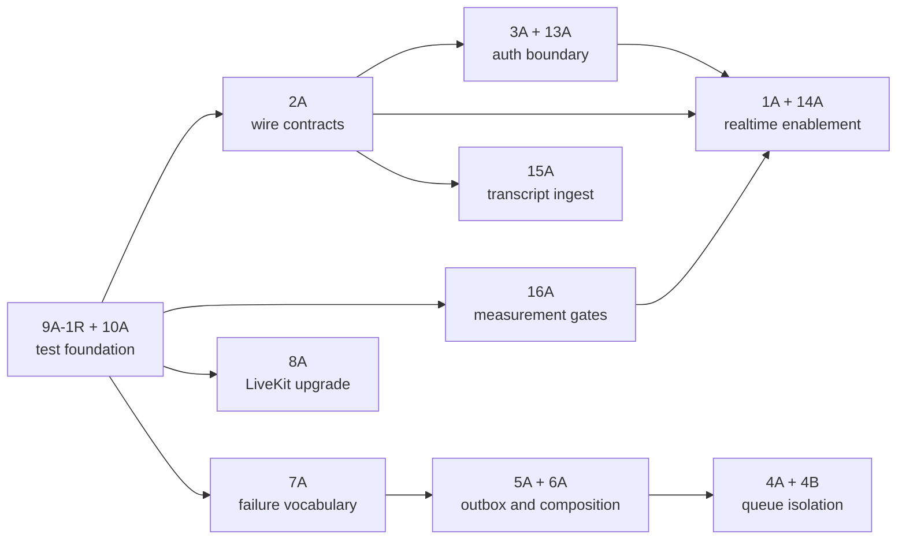

# Agent/API Architecture and Engineering Review Decision Record

- **Date:** 2026-07-30
- **Scope:** `apps/agent`, `apps/api`, and the shared contracts and
  infrastructure that directly connect them
- **Status:** Review complete; directions recorded; implementation requires a
  separate, explicitly authorized change
- **Review mode:** Big change, four sections, at most four top issues per section

This document is the durable record of the 16 issues reviewed interactively.
It preserves the evidence, alternatives, concrete tradeoffs, accepted
directions, proposed solutions, dependencies, and validation gates so that the
conversation is not the only source of truth.

Line references are a snapshot of the repository on the date above. If code
moves, use the named symbol as the durable locator.

## Engineering Preferences Applied

The recommendations use these agreed priorities:

- Treat cross-process duplication and repeated policy as defects, while avoiding
  abstractions that merely hide two simple lines.
- Prefer explicit construction, contracts, limits, and failure categories over
  implicit framework behavior or clever indirection.
- Require strong unit, integration, concurrency, failure-path, and end-to-end
  evidence in proportion to the risk.
- Preserve correctness and edge-case handling before optimizing for delivery
  speed.
- Engineer to measured constraints. Do not invent scale targets, cache layers,
  indexes, or worker limits before representative measurements exist.
- Keep the API and PostgreSQL as the durable authority. Realtime delivery is an
  observer of durable state, not an alternate source of truth.

## Decision Ledger

| Issue | Area | Recorded decision | Status |
|---|---|---|---|
| 1 | Realtime correctness | **1A** — API-authoritative realtime observer with resynchronization | Accepted |
| 2 | Cross-app contracts | **2A** — small, versioned shared wire-contract package | Accepted; implemented |
| 3 | Authentication boundary | **3A** — validate Clerk authorized parties | Accepted |
| 4 | Worker isolation | **4A + 4B** — split critical/background queues and add explicit limits, metrics, and load criteria | Accepted |
| 5 | Outbox structure | **5A** — split the topic god module by cohesive topic family | Accepted |
| 6 | Dependency construction | **6A** — explicit, thin composition roots with typed dependencies | Accepted |
| 7 | Provider failures | **7A** — one typed provider-failure vocabulary; distinguish internal defects | Accepted |
| 8 | LiveKit compatibility | **8A** — staged upgrade and removal of private SDK dependencies | Accepted |
| 9 | Python/test reliability | **9A-1R** — Python 3.13 contract, test-only cancellation-regression stabilization, per-test timeouts | Accepted; implemented |
| 10 | Coverage | **10A** — measured line and branch coverage ratchets | Accepted; implemented |
| 11 | Voice behavior evaluation | **11C** — retain credential-gated manual evaluations | Accepted risk |
| 12 | Agent-process E2E | **12C** — retain current provider-free E2E boundary | Accepted risk |
| 13 | Authentication performance | **13A** — application-scoped, cached, nonblocking, bounded Clerk verifier | Accepted |
| 14 | Realtime scaling | **14A** — per-active-user subscriptions and bounded socket delivery | Accepted |
| 15 | Transcript ingest | **15A** — preserve per-segment durability while removing redundant work | Accepted |
| 16 | Performance governance | **16A** — measure first, then set explicit budgets and thresholds | Accepted |

Decisions **11C** and **12C** deliberately retain test gaps. They must not be
described as solved by later work unless the user explicitly selects a
different option.

## System Boundary Summary

The present high-level separation is sound:

- `apps/web` is the browser-facing dashboard.
- `apps/api` is the durable control plane and tenant authorization boundary.
- PostgreSQL owns business state and the outbox.
- Redis carries ARQ jobs and ephemeral realtime notifications.
- `apps/agent` is a separately deployed LiveKit media-plane worker.
- External providers are reached through adapters, but error policy and object
  construction currently leak across several layers.

The primary architectural concern is not that these processes exist. It is
that their wire contracts, dependency creation, failure taxonomy, work
isolation, and realtime semantics are not yet explicit enough for safe
independent deployment and scaling.

## Proposed Dependency and Delivery Order



This is a dependency recommendation, not a timeline commitment. Capacity,
traffic, availability objectives, and launch dates were intentionally not
assumed.

---

# 1. Architecture Review

## Issue 1 — Realtime Is Disabled and Its Delivery Contract Is Not Explicit

### Concrete problem and evidence

- `apps/api/app/core/config.py:14` defaults `realtime_enabled` to `False`.
- `apps/api/.env.example:6` and `compose.dev.yaml:194` also disable it.
- `apps/api/app/main.py:117-133` conditionally creates the realtime service and
  fanout task.
- `apps/api/app/services/livekit_dispatch_service.py:347-367` commits the
  durable call transition before making a best-effort realtime publication.
  That ordering is good, but the client recovery contract is not encoded.
- `apps/api/app/services/realtime_service.py:55-62` forwards messages without
  detecting gaps, versions, or stale events.

If realtime is enabled as-is, users may see lost or out-of-order notifications
after reconnects, API restarts, Redis interruption, or concurrent updates. The
durable database remains correct, but the UI can temporarily present stale
state unless it knows to resynchronize.

### Options and tradeoffs

| Option | Effort | Risk | Impact on other code | Ongoing maintenance |
|---|---:|---:|---|---|
| **1A — Selected and recommended:** make realtime an API-authoritative observer with reconnect/gap resynchronization, then enable it behind gates | Medium | Low data-integrity risk; moderate rollout risk | Event envelope, websocket client, API reads, tests, and rollout config | Low–medium; one explicit delivery contract |
| **1B:** use a durable event log such as Redis Streams for replay | High | Moderate operational and migration risk | Publishing, consumption, retention, acknowledgements, deployment, and monitoring | High; introduces a second durable lifecycle |
| **1C:** enable the current best-effort Pub/Sub implementation unchanged | Low | High stale-view and scale risk | Mostly configuration | Low initially; incident burden is high |

### Recorded decision and proposed solution — 1A

Yes, this direction is specifically intended to make the realtime feature safe
to enable.

1. Keep PostgreSQL and ordinary API reads as the authority.
2. Define a versioned realtime envelope containing the event type, durable
   resource identifier, resource version or monotonic cursor where applicable,
   and a schema version.
3. Treat notifications as invalidation hints. The client fetches the durable API
   representation on initial connect, reconnect, detected gap, unknown schema,
   or ambiguous ordering.
4. Make duplicate and stale messages harmless.
5. Enable realtime progressively only after decisions 2A, 3A/13A, and 14A have
   passed their tests and representative connection/load gates.
6. Retain a kill switch so rollout can return to polling/refetch without
   compromising durable operations.

### Required validation

- Contract tests for duplicate, stale, reordered, missing, and unknown-version
  events.
- Browser integration tests for reconnect and API resynchronization.
- Redis interruption/recovery tests proving durable state is still visible.
- Authorization tests proving a socket sees only its owner’s resources.
- A staged rollout metric for connection count, dropped/coalesced messages,
  resync rate, send timeouts, and fanout latency.

## Issue 2 — Agent/API Wire Contracts Are Duplicated

### Concrete problem and evidence

- `apps/agent/agent/schemas.py:14,61-149` independently defines speaker values,
  dispatch metadata, transcript items, and completion payloads.
- `apps/api/app/schemas/agent_runtime.py:8-43` defines overlapping speaker,
  identity, and transcript request/response contracts.
- `apps/api/app/schemas/calls.py:10-24` separately defines completion
  request/response payloads.
- `libs/shared/pyproject.toml:1-9` exists but contains no actual contract
  dependency or version policy.
- `libs/shared/constants.py:1`,
  `apps/api/app/core/redis.py:12-14`, and
  `apps/agent/agent/event_publisher.py:5-7` duplicate the realtime prefix.
- `libs/shared/test_contract.py:1-28` compares source text rather than
  serialized compatibility, so it can pass while runtime payloads drift.

This is a deployment boundary. Duplicating enums and JSON shapes permits one
app to deploy a payload that the other app cannot parse.

### Options and tradeoffs

| Option | Effort | Risk | Impact on other code | Ongoing maintenance |
|---|---:|---:|---|---|
| **2A — Selected and recommended:** a deliberately small, versioned shared Python package for wire contracts and constants | Medium | Low–moderate migration risk | Both app dependency files, serializers, fixtures, and CI compatibility tests | Low; one source of truth with controlled scope |
| **2B:** generate clients/models from OpenAPI or JSON Schema | High | Toolchain and generated-code churn | Build/release pipeline and most API consumers | Medium–high; strongest when many languages consume the API |
| **2C:** retain duplicate models and manual synchronization | None now | High drift risk | No immediate changes | High review burden and recurring defects |

### Recorded decision and implemented solution — 2A

1. Put only cross-process wire types, enum values, event names, and serialization
   helpers in `libs/shared`. Do not move database models, services, repositories,
   or provider implementations there.
2. Add an explicit `schema_version` to independently deployed payloads.
3. Make producers emit version N and consumers read N plus N-1 during a
   documented rolling-deploy window.
4. Replace source-text assertions with golden JSON fixtures and parse/serialize
   compatibility tests executed from both apps.
5. Require additive changes by default. Breaking removal or reinterpretation
   requires a version transition and deployment sequence.

Implementation evidence: the [shared package](../../libs/shared), its
[reviewed golden fixtures](../../libs/shared/tests/fixtures/v1), the
[implementation design](../superpowers/specs/2026-07-31-shared-wire-contracts-design.md),
and the [delivery plan](../superpowers/plans/2026-07-31-shared-wire-contracts.md)
now provide one versioned source of truth at the API/agent/Redis seams. This
makes a later realtime implementation safer; it does **not** enable realtime.
The accepted risks in decisions 11C and 12C are unchanged.

### Required validation

- Round-trip tests for every shared payload.
- N/N-1 producer/consumer fixture matrix.
- Unknown fields, unknown enum values, missing optional fields, invalid
  versions, and maximum-size payload tests.
- An independent-deployment test: old consumer/new producer and new
  consumer/old producer.

## Issue 3 — Clerk Tokens Are Not Bound to Authorized Parties

### Concrete problem and evidence

- `apps/api/app/core/auth.py:45-76` verifies signature, issuer, and optionally
  audience, but does not validate Clerk’s authorized-party (`azp`) boundary.
- `apps/api/app/core/config.py:19-23` provides issuer, audience, key, and JWKS
  settings but no allowed authorized parties.
- The same verifier is used for REST authentication and feeds websocket
  authentication, so the omission crosses both API boundaries.

Issuer and signature verification establish who issued a token. They do not by
themselves restrict which authorized frontend party may present it. A stolen or
misdirected session token from another allowed Clerk context may therefore have
a broader acceptance boundary than intended.

### Options and tradeoffs

| Option | Effort | Risk | Impact on other code | Ongoing maintenance |
|---|---:|---:|---|---|
| **3A — Selected and recommended:** configure and validate an explicit authorized-party allowlist | Low–medium | May initially reject tokens from an omitted legitimate origin | Settings, REST/websocket auth tests, deployment config | Low; origins change infrequently |
| **3B:** rely on audience validation alone | Low | Medium; audience and presenting party solve different boundaries | Minimal configuration | Low, but leaves the party-binding gap |
| **3C:** retain issuer/signature-only behavior | None | Medium–high token replay/acceptance risk | None | Low code burden; higher security review burden |

### Recorded decision and proposed solution — 3A

1. Add an explicit list of canonical authorized parties for each environment.
2. Fail closed outside a clearly identified local-development mode when the
   allowlist is absent.
3. Validate `azp` after signature, issuer, temporal claims, and configured
   audience validation.
4. Apply the exact same validation policy to REST and websocket tokens through
   the shared verifier described in 13A.
5. Log only safe failure categories; never log raw bearer tokens or complete
   claims.

### Required validation

- Correct, missing, malformed, and wrong `azp`.
- Multiple valid deployment origins.
- Preview/local/production configuration separation.
- REST and websocket parity.
- Key rotation, expired/not-yet-valid tokens, wrong issuer/audience, and
  redaction tests.

## Issue 4 — One Worker Queue Mixes Critical and Slow Background Work

### Concrete problem and evidence

- At review time, `apps/api/app/workers/arq_worker.py:60-86` registered call
  finalization, transcript flushing, outbox delivery, and reconciliation in one
  worker configuration and queue.
- The worker does not declare workload-specific concurrency caps, queue classes,
  or explicit job timeout policy at that boundary.
- `apps/api/app/workers/jobs/outbox_delivery.py:139-231` loops through provider
  work and awaits handlers serially; provider latency can occupy capacity needed
  by call-lifecycle work.

**Current-state annotation (2026-07-31):** HTTP transcript append plus
completion recovery superseded the obsolete `transcript_flush_job`. No
production enqueue site existed, so the ARQ entry point was removed rather than
carried into a future queue split. Transcript durability is now an HTTP/database
boundary; the remaining worker split concerns call finalization and lifecycle
reconciliation versus provider/outbox work.

A slow storage, telephony, billing, or LiveKit provider can create
head-of-line blocking for call finalization or lifecycle reconciliation. The
single queue is also a deployment-level single failure and scaling domain.

### Options and tradeoffs

| Option | Effort | Risk | Impact on other code | Ongoing maintenance |
|---|---:|---:|---|---|
| **4A — Selected and recommended:** split critical call-lifecycle work from background provider/outbox/reconciliation work; keep transcript durability on HTTP/database paths | Medium–high | Routing and deployment mistakes during migration | Job routing, worker settings, compose/deployment manifests, operations | Medium; two explicit scaling domains |
| **4B — Also selected:** add per-class concurrency, timeout, graceful-shutdown, metrics, and measured load thresholds | Medium | Incorrect guessed limits if not load-tested | Job definitions, telemetry, dashboards, alerts, deployment settings | Medium; limits must be revisited with traffic |
| **4C:** keep one unbounded workload class | None | High noisy-neighbor and incident blast-radius risk | None | Low code burden; high operational burden |

### Recorded decision and proposed solution — 4A + 4B

1. Define two explicit worker classes:
   - **Critical:** call finalization and lifecycle reconciliation required to
     make a call durably correct. Transcript persistence/recovery remains on the
     synchronous HTTP/database path and is not an ARQ workload.
   - **Background:** external-provider delivery, recording/summary work, and
     non-urgent reconciliation.
2. Route jobs explicitly; do not infer the queue from string conventions alone.
3. Preserve per-call/per-aggregate ordering and idempotency. Prevent concurrent
   delivery where a provider operation requires single-flight behavior.
4. Set job-specific deadlines and retry ceilings based on idempotency and
   provider semantics.
5. Measure queue delay, runtime, attempts, backlog size, oldest-job age,
   saturation, timeout, and dead-letter/exhaustion outcomes.
6. Derive replica counts and concurrency from load evidence under 16A, not from
   arbitrary constants.

### Required validation

- A slow/failing background provider cannot delay critical finalization and
  lifecycle-reconciliation jobs beyond the agreed SLO.
- Duplicate delivery, process death after provider success, process death before
  commit, retry exhaustion, poison jobs, and graceful shutdown.
- Deployment rollback while both old and new workers may temporarily coexist.
- Queue backlog and saturation alerts tested with synthetic load.

---

# 2. Code Quality Review

## Issue 5 — `outbox_topics.py` Is a Cross-Domain God Module

### Concrete problem and evidence

- `apps/api/app/workers/jobs/outbox_topics.py` is approximately 1,552 lines.
- `apps/api/app/workers/jobs/outbox_topics.py:1-68` imports repositories,
  provider factories, settings, and services from several bounded contexts.
- It handles phone provisioning (`:116`), phone routing (`:256`), LiveKit
  dispatch (`:688`), verification dispatch (`:1018`), summary work (`:1368`),
  and recording work (`:1456`).
- A single handler registry at `:1542-1552` ties these unrelated workflows
  together.

The module mixes validation, admission, provider interaction, reconciliation,
persistence, and topic registration. Changes in unrelated provider domains
collide in one file, tests need wide fixtures, and repeated delivery policy is
hard to identify.

### Options and tradeoffs

| Option | Effort | Risk | Impact on other code | Ongoing maintenance |
|---|---:|---:|---|---|
| **5A — Selected and recommended:** split by cohesive topic family while retaining one explicit registry and small shared primitives | Medium | Import/routing regressions if moved without characterization tests | Worker imports, focused tests, registry | Low–medium; clearer ownership and smaller test surfaces |
| **5B:** extract only repeated helpers but keep all handlers in one file | Low | Low migration risk; leaves the ownership problem | Local module only | Medium–high as the file continues growing |
| **5C:** retain the module unchanged | None | Increasing change-collision and regression risk | None | High |

### Recorded decision and proposed solution — 5A

Use a shallow, explicit structure such as:

```text
apps/api/app/workers/outbox/
├── delivery.py
├── registry.py
├── failures.py
├── phone.py
├── livekit.py
└── post_call.py
```

The exact names may follow existing repository conventions, but the boundaries
should remain:

1. Core delivery owns claiming, idempotent completion/failure, retry policy, and
   dispatch through an explicit registry.
2. Topic-family modules own their domain validation and provider orchestration.
3. Shared helpers must encode genuine repeated policy, not become a generic
   workflow framework.
4. Dependencies arrive through the composition root from 6A.
5. Characterization tests lock current transaction and idempotency behavior
   before moving code.

### Required validation

- Registry completeness: every persisted topic has exactly one handler.
- Transaction boundaries and safe crash windows.
- Every retryable/terminal provider outcome.
- Duplicate, stale, malformed, and already-completed work.
- No circular imports and no service-locator calls inside handlers.

## Issue 6 — Object Construction Is Scattered Through Request and Job Code

### Concrete problem and evidence

- `apps/api/app/main.py:98-166` constructs some application resources.
- `apps/api/app/webhooks/livekit.py:292-303` constructs a
  `LiveKitDispatchService` and concrete repositories/providers inside a request
  path.
- `apps/api/app/workers/jobs/outbox_topics.py:20-68` imports concrete
  implementations and settings directly.
- `apps/agent/agent/main.py:251-320` builds the pipeline, event publisher, API
  client, and session runtime.
- `apps/agent/agent/pipeline_factory.py:18-230` repeatedly fetches global
  settings and dynamically imports providers.

Dependencies and their lifetime are therefore implicit. A test can accidentally
exercise a global singleton or real adapter, while production can create the
same expensive resource at several lifetimes.

### Options and tradeoffs

| Option | Effort | Risk | Impact on other code | Ongoing maintenance |
|---|---:|---:|---|---|
| **6A — Selected and recommended:** one thin, manual composition root per process with typed constructor dependencies | Medium | Constructor-signature churn during migration | API startup, worker startup, agent startup, handlers, test factories | Low–medium; explicit wiring is easy to inspect |
| **6B:** introduce a dependency-injection container/framework | High | Runtime magic, scope mistakes, and learning cost | Broad application structure | High relative to current project size |
| **6C:** retain mixed globals/factories/direct construction | None | Hidden coupling and weak isolation persist | None | High testing and debugging burden |

### Recorded decision and proposed solution — 6A

1. Establish an explicit composition root for the API process, ARQ worker
   process, and LiveKit agent worker.
2. Each root reads settings once, constructs long-lived clients/pools once, and
   passes typed dependencies to thin handlers/services.
3. Constructors make required dependencies required. Optional behavior uses an
   explicit null adapter only when absence is a supported mode.
4. Tests call the same composition functions with boundary fakes; they do not
   patch deep module globals.
5. Do not introduce a service locator, reflection-based autowiring, or a DI
   framework.

### Required validation

- Startup/shutdown tests prove every long-lived client closes once.
- Unit tests can construct services without environment variables or network.
- Integration tests use real repositories and fake only external systems.
- Static typing catches omitted/miswired dependencies.

## Issue 7 — Provider Error Policy Is Repeated and Unexpected Defects Are Misclassified

### Concrete problem and evidence

- `apps/api/app/providers/telephony/base.py:6-23`,
  `apps/api/app/providers/subscriptions/base.py:5-43`, and
  `apps/api/app/providers/storage/base.py:6-20` define similar but distinct
  retryable/terminal provider failures.
- `apps/api/app/providers/carrier_lookup/base.py:8-26` uses string categories
  without the same error type.
- `apps/api/app/providers/livekit_dispatch/base.py:14-23` has no common provider
  failure contract.
- `apps/api/app/providers/livekit_recording/livekit.py:527-543` defines failure
  behavior in the concrete adapter.
- `apps/api/app/workers/jobs/outbox_delivery.py:38-62,88-93,113-136` repeats
  classification/redaction policy and maps unexpected exceptions to
  `provider_retryable`.
- `apps/agent/agent/api_client.py:16-44` has another retryable/permanent
  vocabulary for an adjacent boundary.

Mapping an internal programming defect to “provider retryable” can cause futile
retries, hide a regression as provider instability, and delay high-severity
alerts. The repeated taxonomies also drift.

### Options and tradeoffs

| Option | Effort | Risk | Impact on other code | Ongoing maintenance |
|---|---:|---:|---|---|
| **7A — Selected and recommended:** one typed boundary failure vocabulary plus a separate internal-defect path | Medium | Broad but mechanical adapter migration | Provider bases/adapters, workers, telemetry, tests | Low; centralized policy and redaction |
| **7B:** share helper functions while retaining provider-specific exception families | Low–medium | Less migration risk but partial consistency | Error mapping and worker only | Medium; several vocabularies remain |
| **7C:** retain current classifications | None | High retry, diagnosis, and alerting risk | None | High repeated policy burden |

### Recorded decision and proposed solution — 7A

Define an explicit, small failure value at the external-provider boundary:

- **Disposition:** retryable or terminal.
- **Safe class:** timeout, rate-limited, unavailable, authentication,
  validation, conflict, not-found where semantically valid, and unknown
  provider failure.
- **Safe operation code/context:** enough to operate the system without secrets
  or raw provider responses.
- **Cause:** retained for internal tracing, never blindly serialized or logged.

Provider adapters translate SDK-specific exceptions exactly once. Services and
workers branch on the structured failure. An exception not translated at the
adapter boundary is an **internal defect**, not a provider failure: alert it at
higher severity, preserve safe diagnostics, and retry only when the operation
is proven idempotent and the explicit job policy permits it.

Do not force agent-to-API transport errors and third-party provider errors into
one inheritance hierarchy. They may share category names and observability
mapping while remaining different boundary types.

### Required validation

- Table-driven tests for every adapter exception mapping.
- Unexpected `TypeError`, invariant failure, cancellation, timeout, malformed
  provider response, authentication, rate limit, and conflict.
- Redaction tests for messages, metadata, tokens, phone numbers, and provider
  response bodies.
- Retry tests prove terminal and internal-defect paths cannot loop
  indefinitely.

## Issue 8 — LiveKit Is Pinned to an Old Family and Uses Private APIs

### Concrete problem and evidence

- `apps/agent/pyproject.toml:7-13` pins the LiveKit package family to `1.4.4`.
- `apps/agent/Dockerfile:14` calls the private
  `_EUORunnerMultilingual._download_files()` method.
- `apps/agent/agent/pipeline_factory.py:193-198` mutates a private `_executor`.
- `apps/agent/agent/main.py:359-368` imports
  `speechmatics.voice._smart_turn.SmartTurnDetector`.
- `apps/agent/pyproject.toml:61` suppresses typing concerns for that private
  module.
- `apps/agent/agent/debug_streams.py:98-163` subclasses SDK pipeline nodes,
  making upgrade characterization important even where hooks are public.

Private names have no compatibility promise. The strict old-family pin reduces
surprise today but makes security fixes, provider compatibility, and future
upgrades progressively harder.

### Options and tradeoffs

| Option | Effort | Risk | Impact on other code | Ongoing maintenance |
|---|---:|---:|---|---|
| **8A — Selected and recommended:** characterize behavior, upgrade the LiveKit family in stages, and replace private hooks with supported APIs | Medium–high | Voice regressions if staging evidence is weak | Agent build, pipeline setup, detector, lifecycle, tests | Medium; routine staged upgrades thereafter |
| **8B:** freeze `1.4.4` indefinitely | Low now | Growing security, compatibility, and migration risk | None immediately | High deferred-upgrade burden |
| **8C:** jump the entire family to the latest version in one change | Medium | High regression blast radius and poor fault isolation | Broad agent runtime | Medium after a risky migration |

### Recorded decision and proposed solution — 8A

1. First characterize dispatch metadata parsing, job/session callbacks, turn
   detection, prewarm/download, debug instrumentation, metrics, and graceful
   shutdown on the current version.
2. Consult the current official LiveKit documentation for the target version;
   do not infer public replacements from private implementation details.
3. Upgrade one coherent LiveKit dependency family step at a time with a locked
   compatibility matrix.
4. Replace private executor mutation and detector imports with supported
   lifecycle/configuration hooks.
5. Replace Docker-time private downloader calls with a documented command,
   public download API, or explicit artifact build step.
6. Evaluate smart-turn behavior separately from the SDK upgrade using measured
   latency, interruption, false-endpoint, and language behavior. Retain it only
   if it earns its complexity.

### Required validation

- Unit and contract tests for metadata, callbacks, error translation, and
  shutdown.
- Recorded/scripted audio integration cases covering silence, interruption,
  long utterance, quick backchannel, French speech, provider timeout, and
  cancellation.
- Container build test proving all required model assets are present without
  private imports.
- Manual real-provider staging call matrix before promotion.

---

# 3. Test Review

## Issue 9 — Python Runtime Drift and a Teardown-Induced Cancellation Test Hang

### Concrete problem and evidence

- At review time, `apps/api/pyproject.toml` and `apps/agent/pyproject.toml`
  declared Python `>=3.11`, while Docker, CI, Ruff, and mypy targeted Python
  3.13. The reviewed local virtual environments used Python 3.12.13.
- The focused observability cancellation test could hang until the CI job
  timeout, and neither app applied a per-test timeout plugin.
- Systematic diagnosis proved the apparent production cancellation RED was
  caused by `asyncio.to_thread(threading.Event.wait)` interacting with
  AnyIO/`asyncio.Runner` teardown. A proposed production `uncancel()` change
  did not affect the failure and was rejected.

A hanging test can consume the entire CI job timeout, and runtime drift means
local success may not describe the production/CI interpreter. The diagnosis
did not establish a production observability defect.

### Options and tradeoffs

| Option | Effort | Risk | Impact on other code | Ongoing maintenance |
|---|---:|---:|---|---|
| **9A-1R — Selected amendment:** standardize Python 3.13, stabilize the cancellation regression test without production changes, and add per-test deadlines | Medium | Lock/environment churn; async test scheduling needs care | Both app toolchains, CI, tests | Low–medium |
| **9B:** support and test Python 3.11–3.13 | High | Larger compatibility surface and slower CI | Both app matrices and dependency policy | High; no current product requirement justifies it |
| **9C:** retain `>=3.11` and job-level timeouts | None | Hidden hangs and runtime-specific regressions persist | None | High debugging cost |

### Recorded decision and implemented solution — 9A-1R

The executable implementation plan is:
[Python Test Foundation Implementation Plan](../superpowers/plans/2026-07-30-python-test-foundation.md).

The approved **9A-1R** amendment is:

1. Make Python 3.13 the explicit repository/API/agent contract.
2. Leave production observability unchanged. The rejected production
   cancellation patch did not affect the diagnosed teardown failure.
3. Keep `@pytest.mark.timeout(2)` on the focused cancellation regression.
4. Replace its thread-backed startup wait with bounded async condition polling.
5. Yield to the scheduler once after `shutdown_task.cancel()` and before
   releasing the provider.
6. Retain observable assertions for cleanup, cancellation propagation, and
   reinitialization.
7. Add bounded per-test timeouts with explicit longer markers for genuine
   credentialed evaluations, while retaining job-level CI timeouts as the
   outer safety net.

Final evidence: the focused regression passed 20 consecutive runs, all 20
observability tests passed, and the noncredentialed agent suite passed.

### Required validation

- The focused test has a two-second deadline and passes repeatedly with no
  thread-backed wait involved in its startup synchronization.
- The test observes cancellation propagation, one completed provider cleanup,
  and successful reinitialization after cleanup.
- Both complete Python suites run under 3.13 with no unbounded test.
- Timeout diagnostics identify the hanging test and retain useful stack output.

## Issue 10 — CI Has No Line or Branch Coverage Contract

### Concrete problem and evidence

- The API collected approximately 2,102 tests and the agent approximately 254
  during review, but test count alone does not establish exercised behavior.
- `.github/workflows/ci.yml:79-80,109-110` runs ordinary `pytest` without a
  line or branch threshold.
- Neither Python app declares `pytest-cov`/coverage enforcement.

Large suites can still omit error branches and can silently lose coverage as
code changes.

### Options and tradeoffs

| Option | Effort | Risk | Impact on other code | Ongoing maintenance |
|---|---:|---:|---|---|
| **10A — Selected and recommended:** measure complete line/branch baselines and enforce non-decreasing ratchets | Medium | Initial CI time and honest baseline may be lower than expected | Dependencies, CI commands, baseline files, test additions | Low–medium; explicit updates require review |
| **10B:** impose an arbitrary high percentage immediately | Low setup, potentially high test churn | Encourages low-value tests/exclusions and threshold gaming | Broad rushed test work | Medium–high |
| **10C:** publish coverage without failing CI | Low | Coverage can regress without consequence | CI reporting only | Low code burden, weak governance |

### Recorded decision and proposed solution — 10A

The detailed executable plan is the same
[Python Test Foundation Implementation Plan](../superpowers/plans/2026-07-30-python-test-foundation.md).

1. Measure each complete app suite after the test-only 9A-1R stabilization is
   verified.
2. Record independent line and branch baselines.
3. Fail CI on regression below either baseline.
4. Require an intentional, reviewed baseline update only for a repeatable
   improvement attributable to code or test changes; CI never initializes or
   overwrites it, and one stochastic higher run does not justify a raise.
5. Add tests for valuable missing behavior instead of exclusions or percentage
   padding.

The original genuine API run measured 89.545% line and 76.469% branch and
initialized the current downward-rounded 89.54% and 76.46% floors. A later
unchanged-code run measured 89.588% and 76.664%, isolated to alternate
`billing_service.py` paths. Both pass; the later stochastic increase does not
change the baseline.

### Required validation

- Checker subprocess tests cover pass, line regression, branch regression,
  malformed reports, missing files, downward rounding, and raw precision
  boundaries.
- Baseline initialization stages and flushes a complete payload before an
  atomic no-clobber install, with staging cleanup on success and failure.
- Complete suites generate branch data and enforce independent app thresholds.
- Focused local test commands remain fast and are not forced to satisfy the
  full-suite threshold.

## Issue 11 — Voice Behavior Evaluations Do Not Produce CI Evidence

### Concrete problem and evidence

- `apps/agent/tests/evals/test_receptionist_behavior.py:11-32` skips when
  provider credentials are unavailable.
- The acting model and model-based judge are closely coupled in
  `:55-78,100-128`, increasing correlated judgment bias.
- The suite covers only a small set of behaviors, including unknown answers,
  prompt injection/refund, callback details, and appointment handling.
- CI supplies no real-provider credentials, so these evaluations do not protect
  pull requests or releases.

This is a test-evidence gap, not necessarily a product bug. The current suite
can be useful manually but cannot substantiate stable voice behavior in CI.

### Options and tradeoffs

| Option | Effort | Risk | Impact on other code | Ongoing maintenance |
|---|---:|---:|---|---|
| **11A — Review recommendation:** run a protected scheduled/release evaluation with pinned actor, separate judge, thresholds, and artifacts | Medium–high | Provider cost, nondeterminism, credential governance, false positives | CI/release workflow, eval corpus, reporting | Medium–high |
| **11B:** build a deterministic scripted-model behavior harness for core policy, retaining real-provider checks for staging | Medium | Does not measure real model quality, but gives stable policy evidence | Agent seams, fake model, tests | Medium |
| **11C — Selected:** retain credential-gated manual evaluations | None | High residual risk of undetected behavior regression | No production changes | Low automation burden; high manual assurance burden |

### Recorded decision and proposed solution — 11C

No automation expansion is authorized. Preserve the tests as explicitly manual
credentialed evaluations:

1. Keep their skip reason and invocation documented and visible.
2. Give them a distinct marker and an explicit longer timeout under 9A-1R.
3. Do not count skipped manual evaluations as CI behavioral coverage.
4. Record actor model, judge model, prompt version, date, and raw/safe artifacts
   when a human runs them.
5. Revisit 11A or 11B before behavior regressions become release-blocking or
   before the cost of a failed receptionist interaction exceeds the operational
   cost of automated evaluation.

**Accepted residual risk:** pull requests and ordinary CI can regress
receptionist behavior without these tests detecting it.

### Required validation

- The manual command fails clearly when credentials are absent and cannot be
  mistaken for a passing behavioral evaluation.
- Each recorded run identifies prompt, actor, judge, corpus, thresholds, and
  failures.
- The manual suite remains runnable after dependency and prompt changes.

## Issue 12 — E2E Does Not Exercise the Real Agent Process Lifecycle

### Concrete problem and evidence

- `.github/workflows/ci.yml:149-173` runs the repository E2E script but does not
  launch the LiveKit agent worker.
- `scripts/run-local-e2e.sh:133-145` starts migrations, API, worker, and web,
  not the agent.
- `README.md:160,182-187` describes a provider-free local path and explicitly
  excludes the live agent/provider boundary.

The browser/API/worker journey is valuable, but it cannot detect agent startup,
dispatch, crash recovery, protocol drift at runtime, or graceful-shutdown
failures.

### Options and tradeoffs

| Option | Effort | Risk | Impact on other code | Ongoing maintenance |
|---|---:|---:|---|---|
| **12A — Review recommendation:** add a hermetic LiveKit-compatible test path that launches a real agent process and exercises crash/recovery | High | Harness complexity and possible flakiness | E2E infrastructure, agent seams, CI resources | High but provides the strongest lifecycle evidence |
| **12B:** add a subprocess contract integration test for API↔agent lifecycle without browser or real providers | Medium | Narrower than full E2E but more stable | Agent launch/test harness and API fixtures | Medium |
| **12C — Selected:** retain the current provider-free browser/API/worker E2E boundary | None | Agent lifecycle and process-failure regressions remain undetected | No production changes | Low automation burden; manual staging burden remains |

### Recorded decision and proposed solution — 12C

1. Keep the current E2E suite focused on its actual provider-free boundary.
2. Name and document that boundary accurately; do not describe it as full
   voice-agent E2E coverage.
3. Continue unit/contract/integration coverage around the agent where it can be
   deterministic.
4. Require a documented manual staging call path for real agent lifecycle
   evidence before controlled production promotion.
5. Revisit 12A or 12B if agent process failures become recurrent, the protocol
   changes frequently, or release confidence requires automation.

**Accepted residual risk:** CI cannot prove real agent boot, dispatch, media
session behavior, crash recovery, or shutdown.

### Required validation

- The current E2E suite continues proving its documented browser/API/worker
  journeys without claiming agent coverage.
- The manual staging checklist explicitly exercises agent boot, dispatch,
  ordinary call completion, forced process interruption, recovery, and graceful
  shutdown before production promotion.
- Contract tests continue to catch API/agent payload drift under 2A.

---

# 4. Performance Review

## Issue 13 — Clerk Verification Recreates Cache State and Can Block the Event Loop

### Concrete problem and evidence

- `apps/api/app/core/auth.py:97-101` lazily keeps `PyJWKClient` on an
  `AuthProvider` instance.
- `apps/api/app/core/auth.py:120-124` constructs a new provider for each REST
  dependency invocation, discarding that instance cache.
- `apps/api/app/main.py:117-123` constructs a separate provider for websocket
  auth.
- `apps/api/app/core/auth.py:64` calls synchronous signing-key retrieval in the
  async request path used by `require_user_identity` and realtime
  authentication.

Cold or rotated-key JWKS retrieval can therefore repeat more often than needed
and block the event loop for network duration. A Clerk/JWKS slowdown can become
an API-wide latency and availability problem.

### Options and tradeoffs

| Option | Effort | Risk | Impact on other code | Ongoing maintenance |
|---|---:|---:|---|---|
| **13A — Selected and recommended:** one application-scoped verifier shared by REST/websocket, with reusable cache and bounded nonblocking refresh | Medium | Lifecycle and concurrent key-rotation logic require careful tests | Composition root, auth dependencies, websocket service, settings | Low–medium |
| **13B:** retain per-request providers but use a module-global cached JWK helper | Low–medium | Global test leakage and less explicit lifecycle | Auth module/tests | Medium |
| **13C:** retain per-request synchronous verification | None | High tail-latency/event-loop and repeated-fetch risk | None | High incident risk |

### Recorded decision and proposed solution — 13A

1. Construct one `AuthProvider` in the API composition root and inject it into
   REST and websocket authentication.
2. Reuse a bounded JWKS cache across requests.
3. Make cache-miss/key-refresh work nonblocking to the event loop, for example
   through an async client or a bounded worker-thread boundary.
4. Configure explicit connection/read/total deadlines below the request budget.
5. Coalesce concurrent refreshes so one new `kid` does not trigger a fetch
   stampede.
6. Fail closed when a key cannot be verified. Any stale-key allowance must be
   narrowly specified and must never accept an unknown key.
7. Implement 3A in the same verifier so REST and websocket policy cannot drift.

### Required validation

- Warm-cache requests do not fetch JWKS repeatedly.
- Concurrent cold-cache requests produce a bounded number of fetches.
- Key rotation, unknown `kid`, timeout, malformed JWKS, outage, and shutdown.
- Event-loop responsiveness while JWKS retrieval is slow.
- Authorized-party parity across REST and websocket.

## Issue 14 — Every API Replica Subscribes to Every Tenant Event and Sends Serially

### Concrete problem and evidence

- `apps/api/app/core/redis.py:52-67` uses
  `psubscribe("realtime:user:*")`, so every API replica receives every active
  tenant’s event.
- `apps/api/app/services/realtime_service.py:55-62` processes fanout serially.
- `apps/api/app/websockets/manager.py:29-35` sends sequentially to all sockets
  for a user without a send deadline or bounded per-socket queue.
- Redis clients in `apps/api/app/core/redis.py:17-43` and
  `apps/agent/agent/event_publisher.py:9-26` do not make pool size and
  connection/read timeout policy explicit.

One slow websocket can delay all sockets for that user. Wildcard subscription
duplicates all tenant traffic across every API replica, making cost grow with
both event volume and replica count.

### Options and tradeoffs

| Option | Effort | Risk | Impact on other code | Ongoing maintenance |
|---|---:|---:|---|---|
| **14A — Selected and recommended:** subscribe per active user and use bounded per-socket delivery with timeout/coalescing | Medium–high | Subscription lifecycle races and backpressure policy need care | Redis service, connection manager, metrics, realtime tests | Medium |
| **14B:** replace Pub/Sub with Redis Streams/consumer groups | High | Consumer ownership/replay semantics do not naturally match multi-replica websocket fanout | Realtime architecture and operations | High |
| **14C:** keep wildcard subscription and serial sends | None | High fanout amplification and slow-client risk | None | High scaling/incident burden |

### Recorded decision and proposed solution — 14A

1. Retain Pub/Sub because realtime is ephemeral and clients recover from the
   durable API under 1A. Do not introduce Streams solely to replay observer
   notifications.
2. On the first local socket for a user, subscribe that API replica to the
   user-specific channel. Unsubscribe after the last local socket closes, with
   race-safe reference counting.
3. Give each socket a bounded queue and dedicated sender task.
4. Define overflow behavior explicitly. Prefer coalescing resource-invalidating
   events to the latest version; disconnect a persistently slow consumer when
   correctness cannot be preserved.
5. Apply send deadlines, heartbeat/idle policy, graceful cancellation, and
   explicit Redis pool/connect/read limits.
6. Preserve tenant isolation in channel construction and verify authorization
   before subscription.

### Required validation

- First/last connection races and rapid reconnects.
- Multiple sockets for one user and users distributed across replicas.
- Queue overflow, coalescing, send timeout, dead socket cleanup, cancellation,
  Redis disconnect/reconnect, duplicate/stale events, and shutdown.
- Load tests across event rate × active users × sockets per user × replica
  count.

## Issue 15 — Transcript Ingest Repeats Queries and Retains More Memory Than Needed

### Concrete problem and evidence

- `apps/api/app/routers/agent.py:193-228,237-289` constructs the transcript
  service separately for append and completion/recovery request paths.
- `apps/api/app/services/transcript_service.py:62-80,109-135` locks the call and
  then separately locks/validates the agent configuration on each ordinary
  append.
- `apps/api/app/services/transcript_service.py:157-184` looks up an existing
  sequence before attempting every insert.
- `apps/api/app/repositories/message_repository.py:28-54` uses a nested
  transaction and performs another lookup if a concurrent unique conflict
  occurs.
- `apps/api/app/services/transcript_service.py:82-107` recovers segments through
  a per-item merge loop, multiplying database round trips.
- `apps/agent/agent/session_runtime.py:24-26,59-65,360-385` retains a full
  compatibility transcript of up to 2,000 items in addition to the bounded
  unacknowledged recovery deque; finalization sends only the recovery tail at
  `:548-619`.

Per-segment durability is appropriate for crash recovery, but redundant
ownership/state queries, conflict round trips, looped recovery inserts, and a
full recovery history increase database and memory cost with call length and
concurrency.

### Options and tradeoffs

| Option | Effort | Risk | Impact on other code | Ongoing maintenance |
|---|---:|---:|---|---|
| **15A — Selected and recommended:** preserve per-segment durability while consolidating queries, using atomic conflict handling/bulk recovery, and retaining only needed agent state | Medium–high | Transaction/concurrency changes need PostgreSQL evidence | Router/service/repository, agent buffer, contract/tests | Medium |
| **15B:** batch transcripts client-side before persistence | Medium | Fewer writes but a larger crash-loss window and higher visibility latency | Agent protocol and API ingest | Medium |
| **15C:** retain current per-item/query/history behavior | None | Database and memory growth with call concurrency | None | High scaling cost |

### Recorded decision and proposed solution — 15A

1. Preserve durable ingestion per finalized segment; do not trade away crash
   recovery merely to reduce write count.
2. Resolve ownership and current call state through one authoritative query or
   a clearly reused verified result, without trusting agent-supplied ownership.
3. Use an atomic insert such as `ON CONFLICT ... RETURNING`; perform a conflict
   read only when a collision actually occurs.
4. Recover a tail through a bulk insert/upsert operation and classify the
   returned conflict set instead of issuing one transaction path per segment.
5. Keep only the bounded unacknowledged recovery tail plus the minimal last-item
   state needed for sequencing/finalization in the agent. Do not retain a second
   full transcript when LiveKit/session state already owns it.
6. Keep explicit maximum segment length, tail count, and payload size. Reject
   malformed/gapped/oversized recovery payloads with safe, actionable errors.

### Required validation

- Query-count assertions for ordinary insert, duplicate, and recovery paths.
- Real PostgreSQL concurrency tests for simultaneous duplicates, out-of-order
  items, stale call state, and transaction rollback.
- Agent crash before send, after send/before acknowledgement, repeated recovery,
  API timeout, partial bulk conflict, maximum tail, and memory-bound tests.
- No loss or duplication in the final durable transcript.

## Issue 16 — Performance Limits Are Mostly Implicit and Expensive Queries Are Ungated

### Concrete problem and evidence

- `apps/agent/agent/schemas.py:16-20` permits several prompt sections up to
  4K/8K/32K characters.
- `apps/agent/agent/prompt_builder.py:49-57` injects the configured blocks
  without one model-aware combined token budget.
- `apps/agent/agent/main.py:125-167` attaches transcript callbacks but no
  complete LiveKit turn-latency/usage metrics handler.
- `apps/agent/agent/main.py:378-391` sets drain behavior but no evidenced worker
  load function/threshold or resource capacity.
- `apps/api/app/repositories/call_repository.py:541-592` uses wildcard search
  over summary/structured data with count plus offset pagination.
- `apps/api/app/repositories/call_repository.py:275-305` computes dashboard
  aggregates over the user’s nondeleted rows, with time windows inside
  aggregate expressions rather than a narrow evidence-backed query plan.
- `apps/api/app/core/database.py:9-19` fixes pool sizes without a documented
  concurrency derivation.

There is no single demonstrated bottleneck yet. The risk is tuning by intuition:
adding caches/indexes/limits that do not address measured p95/p99 behavior, or
discovering prompt/context, database, and process-capacity limits only during
load.

### Options and tradeoffs

| Option | Effort | Risk | Impact on other code | Ongoing maintenance |
|---|---:|---:|---|---|
| **16A — Selected and recommended:** instrument representative paths, define SLOs/budgets, then change queries, indexes, caching, and worker limits at measured thresholds | Medium initially; later work evidence-dependent | Low technical risk; requires observation time | Telemetry, load fixtures, prompt validation, database benchmarks, deployment | Medium and purposeful |
| **16B:** proactively add caches, indexes, keyset pagination, and guessed worker limits | Medium–high | Wrong indexes/cache invalidation/limits add complexity without fixing the constraint | Broad data/runtime/deployment code | High |
| **16C:** retain implicit limits and react to incidents | None | High latency, cost, and capacity surprise | None | High operational burden |

### Recorded decision and proposed solution — 16A

1. Capture end-to-end turn latency, end-of-utterance delay, LLM time to first
   token, TTS time to first byte/audio, provider errors, token/character usage,
   and per-job CPU/RSS.
2. Define representative prompt profiles, call durations, call concurrency,
   event rates, and database cardinalities. Agree on SLOs before selecting
   tuning thresholds.
3. Derive one explicit combined prompt budget for the supported model/tokenizer.
   Validate and reject oversized configuration at write or dispatch time with an
   actionable error. Do not silently truncate user business instructions.
4. Capture real PostgreSQL `EXPLAIN (ANALYZE, BUFFERS)` and p50/p95/p99 for
   dashboard aggregation, search, transcript ingest, and list pagination using
   representative cardinality/skew.
5. Add a full-text/trigram index, a narrower aggregate strategy, keyset
   pagination, caching, or query reshaping only when its measured threshold and
   invalidation/consistency contract are documented.
6. Derive database pool size, LiveKit worker load threshold, replica count,
   graceful-drain limit, and resource requests from measured concurrency and
   failure tests.

### Required validation

- Repeatable load profiles with versioned fixtures and reported environment.
- Before/after query plans and latency distributions for every accepted tuning
  change.
- Prompt boundary tests for multilingual text, worst-case tokenizer expansion,
  empty sections, and maximum combined content.
- Overload, provider slowdown, database saturation, Redis slowdown, graceful
  drain, and recovery behavior.
- Alerts tied to the agreed SLOs rather than arbitrary infrastructure metrics.

---

# Cross-Cutting Edge Cases and Non-Negotiable Gates

The following cases recur across multiple issues and should be implemented once
at the appropriate boundary, then tested at every consumer:

- Process cancellation and shutdown during in-flight network or database work.
- Duplicate, stale, reordered, partially applied, and unsupported-version
  messages.
- Provider success followed by local commit failure, and local commit followed
  by publication failure.
- Token/key rotation, clock boundaries, unknown key IDs, wrong presenting party,
  and network timeout.
- Tenant isolation during identifiers, Redis channel construction, websocket
  fanout, repository lookups, and logs.
- Explicit size/count/time/concurrency limits with actionable failure responses.
- Safe logging and tracing that preserve diagnosis without tokens, phone
  numbers, transcript content, or raw provider bodies.
- Rolling deployment where app versions N and N-1 coexist.
- PostgreSQL-specific concurrency behavior tested against PostgreSQL, not only
  an in-memory substitute.

## Accepted Risk Register

| Risk | Decision | Consequence | Current mitigation | Revisit trigger |
|---|---|---|---|---|
| No automated real-model receptionist behavior gate | 11C | CI may miss behavior regressions | Manual credentialed evaluations with recorded artifacts | Behavior becomes a release gate, regressions recur, or staging cost exceeds automation cost |
| No real agent process in E2E | 12C | CI cannot prove boot/dispatch/media/crash/shutdown lifecycle | Unit/contract/integration tests plus manual staging calls | Agent lifecycle defects recur, protocol churn rises, or production promotion requires automated proof |

These are consciously accepted gaps, not omissions from this record.

## Implementation Authorization Boundary

This document records review outcomes only. It does not authorize source,
configuration, dependency, infrastructure, or deployment changes.

The first prepared implementation wave covers **9A-1R and 10A only**:
[Python Test Foundation Implementation Plan](../superpowers/plans/2026-07-30-python-test-foundation.md).
Every later wave should receive its own reviewed implementation plan, should
preserve the issue numbers above, and should state which accepted risks remain
unchanged.
