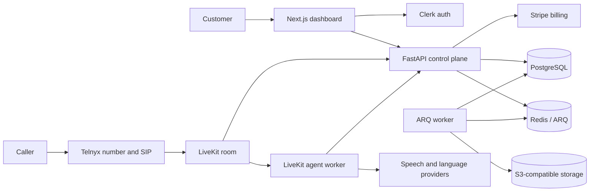

# Presvo Open-Source Documentation Implementation Plan

> **For agentic workers:** REQUIRED SUB-SKILL: Use superpowers:subagent-driven-development (recommended) or superpowers:executing-plans to implement this plan task-by-task. Steps use checkbox (`- [ ]`) syntax for tracking.

**Goal:** Publish a portfolio-first, contributor-friendly documentation set that accurately presents Presvo's implemented capabilities, current limitations, production ambition, and phased roadmap.

**Architecture:** `README.md` becomes the concise public landing page, while `docs/PROJECT_STATUS.md` becomes the canonical feature-status and roadmap source. Root policy files establish the MIT license, contribution workflow, and private security-reporting path; current architecture documents are corrected without rewriting historical plans or specifications.

**Tech Stack:** Markdown, Mermaid, Docker Compose, Python/uv, FastAPI, Next.js/npm, GitHub Security Advisories

## Global Constraints

- Use **Presvo** as the only public product name; “AI voice assistant platform” is descriptive copy, not a competing name.
- State exactly that Presvo is a working pre-production MVP with a production-oriented architecture progressing toward controlled beta.
- Label capabilities only as **Implemented**, **Partial**, **Planned**, or **Exploratory**.
- Treat `docs/PROJECT_STATUS.md` as the only canonical feature-status and roadmap document.
- Guided onboarding is the next product milestone; the Retell-inspired conversation-flow builder is later work.
- Do not claim that the provider-backed voice path works without hosted credentials.
- Do not add roadmap dates, production-readiness claims, private contact details, secrets, customer content, or full real phone numbers.
- Preserve historical specs, plans, and the audit; label historical material instead of rewriting its point-in-time claims.
- Use the existing `docs/landing_page.webp` asset in the README, not the larger PNG.
- Limit implementation changes to documentation and open-source metadata.

---

## File Map

### Files to create

- `LICENSE` — standard MIT grant with `2026 Presvo contributors` as the copyright line.
- `CONTRIBUTING.md` — contributor setup, repository workflow, verification commands, provider boundaries, and secret-handling rules.
- `SECURITY.md` — private vulnerability-reporting instructions through GitHub Security Advisories.
- `docs/PROJECT_STATUS.md` — canonical product boundary, feature matrix, limitations, production gates, and roadmap.

### Files to replace or modify

- `README.md` — replace the operations-first document with the portfolio landing page; link detailed operational material instead of duplicating it.
- `docs/Verdict.md` — prepend a historical/superseded warning without altering the original audit body.
- `docs/architecture/agent-config-api.md` — replace the machine-specific test link.
- `docs/architecture/backend-context.md` — replace machine-specific links, point local-stack language at `compose.dev.yaml`, and redact real staging phone numbers.
- `docs/architecture/billing-usage-api.md` — replace the machine-specific `.env` link.
- `docs/architecture/staging-smoke-runbook.md` — align boot commands with `compose.dev.yaml`, correct migration behavior, remove the worktree path, and redact real phone numbers.

### Files used as evidence but not modified

- `compose.dev.yaml` — authoritative local core-stack and optional `voice` profile behavior.
- `compose.yaml` and `compose.migrate.yaml` — production application and migration boundaries.
- `.github/workflows/ci.yml` — authoritative CI job list.
- `apps/api/.env.example`, `apps/agent/.env.example`, `apps/web/.env.example` — provider and application configuration references.
- `docs/architecture/production-deployment.md` — production topology decision record.
- `docs/runbooks/deploy.md`, `docs/runbooks/rollback.md`, `docs/runbooks/incident-response.md` — detailed operations references.
- `docs/security/dependency-exceptions.md` — current dependency exception register.

---

### Task 1: Add Open-Source License and Contributor Policies

**Files:**
- Create: `LICENSE`
- Create: `CONTRIBUTING.md`
- Create: `SECURITY.md`

**Interfaces:**
- Consumes: verification commands already defined in `README.md`, the three application package manifests, and `.github/workflows/ci.yml`.
- Produces: stable root links used by the rewritten README: `[Contributing](CONTRIBUTING.md)`, `[Security policy](SECURITY.md)`, and `[MIT License](LICENSE)`.

- [ ] **Step 1: Confirm the policy files are currently absent**

Run:

```bash
test ! -e LICENSE
test ! -e CONTRIBUTING.md
test ! -e SECURITY.md
```

Expected: every command exits `0`, confirming these are new files rather than overwrites.

- [ ] **Step 2: Add the MIT license**

Create `LICENSE` with the standard MIT text and this exact identity line:

```text
MIT License

Copyright (c) 2026 Presvo contributors

Permission is hereby granted, free of charge, to any person obtaining a copy
of this software and associated documentation files (the "Software"), to deal
in the Software without restriction, including without limitation the rights
to use, copy, modify, merge, publish, distribute, sublicense, and/or sell
copies of the Software, and to permit persons to whom the Software is
furnished to do so, subject to the following conditions:

The above copyright notice and this permission notice shall be included in all
copies or substantial portions of the Software.

THE SOFTWARE IS PROVIDED "AS IS", WITHOUT WARRANTY OF ANY KIND, EXPRESS OR
IMPLIED, INCLUDING BUT NOT LIMITED TO THE WARRANTIES OF MERCHANTABILITY,
FITNESS FOR A PARTICULAR PURPOSE AND NONINFRINGEMENT. IN NO EVENT SHALL THE
AUTHORS OR COPYRIGHT HOLDERS BE LIABLE FOR ANY CLAIM, DAMAGES OR OTHER
LIABILITY, WHETHER IN AN ACTION OF CONTRACT, TORT OR OTHERWISE, ARISING FROM,
OUT OF OR IN CONNECTION WITH THE SOFTWARE OR THE USE OR OTHER DEALINGS IN THE
SOFTWARE.
```

- [ ] **Step 3: Add the contribution guide**

Create `CONTRIBUTING.md` with these sections and concrete requirements:

````markdown
# Contributing to Presvo

Thanks for helping improve Presvo. The project is in active pre-production
development, so focused fixes, tests, documentation corrections, and small
product improvements are easier to review than broad rewrites.

## Before you start

- Read `README.md` for the product and repository overview.
- Read `docs/PROJECT_STATUS.md` before changing product scope or roadmap copy.
- Open an issue before starting a large feature or architectural change.
- Never include credentials, `.env` files, customer transcripts, recordings,
  or full private phone numbers in an issue, test fixture, log, or commit.

## Prerequisites

- Docker with Docker Compose
- Python 3.13 and uv 0.11.19 for local Python verification
- Node.js 22.19 for the web application

## Repository layout

- `apps/api` — FastAPI control plane, webhooks, billing, persistence, and jobs
- `apps/agent` — LiveKit voice-agent runtime
- `apps/web` — Next.js landing page and customer dashboard
- `libs/shared` — small cross-application Python contracts
- `docs` — architecture decisions, runbooks, status, plans, and specifications

## Local development

Start the core local stack from the repository root:

```bash
docker compose -f compose.dev.yaml up --build
```

This starts PostgreSQL, Redis, MinIO, migrations, the API, the ARQ worker, and
the web application. Without Clerk credentials, the web application shows
configuration notices instead of authenticated customer data.

Live phone calls require hosted provider configuration. Copy only the example
files you need, keep the resulting `.env` files untracked, and start the voice
profile after configuring LiveKit and the selected model providers:

```bash
docker compose -f compose.dev.yaml --profile voice up --build
```

The staging runbook documents the complete provider-backed path:
`docs/architecture/staging-smoke-runbook.md`.

## Verification

### API

```bash
cd apps/api
UV_CACHE_DIR=/tmp/uv-cache uv lock --check
UV_CACHE_DIR=/tmp/uv-cache uv sync --frozen --all-groups
UV_CACHE_DIR=/tmp/uv-cache uv run --frozen --no-sync ruff check app tests
UV_CACHE_DIR=/tmp/uv-cache uv run --frozen --no-sync mypy app
UV_CACHE_DIR=/tmp/uv-cache uv run --frozen --no-sync python -m pytest -q
```

The full API suite expects PostgreSQL and Redis for its integration coverage.

### Agent

```bash
cd apps/agent
UV_CACHE_DIR=/tmp/uv-cache uv lock --check
UV_CACHE_DIR=/tmp/uv-cache uv sync --frozen --all-groups
UV_CACHE_DIR=/tmp/uv-cache uv run --frozen --no-sync ruff check agent tests
UV_CACHE_DIR=/tmp/uv-cache uv run --frozen --no-sync mypy agent
UV_CACHE_DIR=/tmp/uv-cache uv run --frozen --no-sync python -m pytest -q
```

### Web

```bash
cd apps/web
npm ci
npm run check
npm run typecheck
npm run test:ci
npm run build
```

## Change expectations

- Add or update tests for behavior changes.
- Add an Alembic migration for every database schema change.
- Keep routers thin, business rules in services, and database access in
  repositories.
- Keep provider SDK calls inside their provider adapters.
- Update `docs/PROJECT_STATUS.md` when a feature moves between status labels.
- Run the focused checks while iterating and the complete affected-app checks
  before requesting review.
- Keep commits focused and use descriptive messages.

## Security

Do not report vulnerabilities in a public issue. Follow `SECURITY.md`.
````

- [ ] **Step 4: Add the security policy**

Create `SECURITY.md` with this reporting contract:

```markdown
# Security Policy

## Supported versions

Presvo is in active pre-production development. Security fixes are applied to
the current `main` branch; there are no supported release branches yet.

## Reporting a vulnerability

Please do not open a public issue for a suspected vulnerability.

When the repository is public, use GitHub's private vulnerability reporting:

1. Open the repository's **Security** tab.
2. Select **Advisories**.
3. Select **Report a vulnerability**.

Include the affected component, impact, reproduction steps, and a suggested
mitigation when available. Use synthetic data and redact credentials, customer
content, recordings, transcripts, access tokens, and full phone numbers.

Presvo does not currently publish a guaranteed response or remediation window.
Please allow the maintainers to investigate before public disclosure.

## Operational security documentation

- `docs/runbooks/credential-rotation.md`
- `docs/runbooks/incident-response.md`
- `docs/security/dependency-exceptions.md`
```

- [ ] **Step 5: Verify the new policy files**

Run:

```bash
test -s LICENSE
test -s CONTRIBUTING.md
test -s SECURITY.md
rg -n '^# (Contributing to Presvo|Security Policy)$' CONTRIBUTING.md SECURITY.md
rg -n 'Copyright \(c\) 2026 Presvo contributors' LICENSE
git diff --check -- LICENSE CONTRIBUTING.md SECURITY.md
```

Expected: all commands exit `0`; the heading search returns one heading from
each Markdown file and the license search returns the copyright line.

- [ ] **Step 6: Commit the open-source foundation**

```bash
git add LICENSE CONTRIBUTING.md SECURITY.md
git commit -m "docs: add open source project policies"
```

---

### Task 2: Create the Canonical Project Status and Roadmap

**Files:**
- Create: `docs/PROJECT_STATUS.md`

**Interfaces:**
- Consumes: the approved status vocabulary and roadmap from `docs/superpowers/specs/2026-07-15-open-source-documentation-design.md`.
- Produces: the canonical status target linked by `README.md` and the historical notice in `docs/Verdict.md`.

- [ ] **Step 1: Confirm there is no existing canonical status file**

Run:

```bash
test ! -e docs/PROJECT_STATUS.md
```

Expected: exit `0`.

- [ ] **Step 2: Write the product boundary and status vocabulary**

Create `docs/PROJECT_STATUS.md` with this opening:

```markdown
# Presvo Project Status

This document is the canonical source for Presvo's implemented capabilities,
known limitations, production-readiness gates, and roadmap. Historical specs,
plans, and audits describe the repository at earlier points in time and may no
longer match the current implementation.

## Current status

**Active development:** Presvo is a working pre-production MVP with a
production-oriented architecture. Work is progressing toward a controlled
beta, with onboarding, compliance, recovery testing, and real-provider
certification still in progress.

## Current product boundary

- France-only phone-number provisioning
- One `starter` subscription plan
- One agent configuration per customer
- Inbound calls only
- `stt_llm_tts` as the customer-facing launch pipeline
- Stripe-hosted checkout and billing portal
- Telnyx telephony and LiveKit voice runtime
- PostgreSQL as the durable source of truth

## Status vocabulary

- **Implemented** — present in the repository and supported by relevant tests.
- **Partial** — a technical foundation exists, but the customer workflow,
  operational proof, or real-provider validation is incomplete.
- **Planned** — accepted roadmap work with a defined outcome.
- **Exploratory** — a possible direction, not a delivery commitment.
```

- [ ] **Step 3: Add the evidence-based feature matrix**

Add this table, keeping partial features separate from implemented launch
claims:

```markdown
## Feature matrix

| Area | Status | Current evidence and limitation |
|---|---|---|
| Public landing page and authentication shell | **Implemented** | Next.js landing page, Clerk sign-in/sign-up routes, and protected dashboard routing are present. |
| Customer dashboard | **Implemented** | Dashboard, calls, agent settings, billing, onboarding status, empty states, and server actions are present. |
| Guided onboarding | **Partial** | The backend exposes explicit onboarding states and the dashboard shows a checklist, but there is no resumable step-by-step wizard, forwarding guide, or test-call step. |
| Starter billing | **Implemented** | Stripe Checkout, Billing Portal, paid-invoice minute grants, subscription lifecycle handling, and PostgreSQL-backed usage accounting are present. |
| French number provisioning | **Implemented** | Queue-backed Telnyx provisioning, persisted status, retry handling, assignment, and routing gates are present; the current end-to-end path still needs fresh staging certification. |
| Agent configuration | **Implemented** | Customer-owned agent identity, owner context, system prompt, knowledge base, fixed launch pipeline, and guarded routing toggle are present. |
| Inbound voice runtime | **Implemented** | LiveKit dispatch and a separate agent worker support Speechmatics or Deepgram STT, Gemini LLM, and Speechmatics or ElevenLabs TTS. |
| Native-audio STS runtime | **Partial** | Gemini native-audio support exists in the worker and tests but is intentionally hidden from the customer-facing France launch. |
| Durable call lifecycle | **Implemented** | Incremental transcript persistence, call-scoped agent JWTs, a state machine, reconciliation, duration limits, and idempotent finalization are present. |
| Call review | **Implemented** | Call list/detail, transcript, summary, recording availability, signed recording URLs, usage charge, and soft archive are present. |
| Rich call-review workflow | **Partial** | Pagination contracts exist, but the web UI lacks pagination controls, inline audio playback, search, tags, notes, and structured action-item presentation. |
| Recording lifecycle | **Implemented** | LiveKit room-composite egress, private object storage, signed access, and bucket lifecycle configuration are present. |
| Post-call processing | **Implemented** | Transactional outbox handlers cover recording stop, summary generation, notifications, usage charging, and routing disable intent. |
| Live dashboard and intervention | **Partial** | An optional backend WebSocket observer exists but is disabled by default, has a documented identity-key mismatch, and has no live-call web interface. |
| Push notifications | **Partial** | Notification records and provider boundaries exist, but private device-token delivery is not part of the launch path. |
| Production observability and CI | **Implemented** | Readiness checks, safe logging, OpenTelemetry, metrics, pinned CI actions, dependency audits, secret scanning, and container scanning are configured. |
| Production deployment | **Partial** | Hardened images, release migrations, deployment and rollback runbooks, and a provider comparison exist; a production platform and operating evidence are not yet approved. |
| French localization and legal surfaces | **Planned** | The launch UI is still English and approved privacy, terms, legal notice, support, retention, and subprocessor surfaces are absent. |
| Account export and deletion | **Planned** | User-facing export, deletion orchestration, and recording-access audit records are absent. |
| Mobile application | **Exploratory** | No mobile application is present in the repository. |
```

- [ ] **Step 4: Add known limitations and production gates**

Add:

```markdown
## Known limitations

- The customer journey is distributed across dashboard cards, billing, and
  agent settings rather than a guided onboarding experience.
- Real phone calls require external Clerk, Stripe, Telnyx, LiveKit, storage,
  and model-provider configuration.
- The current self-serve flow has not completed fresh multi-customer staging
  certification against all real providers.
- The optional realtime observer is not a supported customer feature.
- The application lacks French localization, approved legal pages, data
  export/deletion, and a complete account menu.
- The repository does not yet contain behavioral voice evaluations,
  accessibility end-to-end tests, load definitions, or completed recovery-drill
  evidence.

## Production-readiness gates

Presvo is intended for production, but it should not be described as
production-ready until all of these gates have evidence:

- Guided onboarding and complete customer account workflows
- Approved French legal, privacy, recording, retention, and support surfaces
- Auditable account export, deletion, and recording access
- Managed backups with a demonstrated restore
- Three clean real-provider staging certification journeys
- Load, concurrency, provider-outage, and recovery drills
- Behavioral voice-agent evaluations
- Accessibility and frontend performance gates
- A monitored controlled beta with explicit stop conditions
```

- [ ] **Step 5: Add the phased roadmap**

Add the five approved phases without dates:

```markdown
## Roadmap

### Phase 1 — Guided onboarding

- Resumable setup wizard
- Business and use-case templates
- Agent identity, context, and structured knowledge collection
- Carrier-aware forwarding instructions
- AI and recording-disclosure acknowledgement
- Test call or browser preview
- Readiness review and go-live action

### Phase 2 — Customer workflow completion

- French localization and locale-aware formatting
- Account and session controls
- Inline recording playback
- Call pagination, search, and richer review workflows
- Account data export and deletion
- Approved legal, privacy, retention, subprocessor, and support surfaces
- Accessibility and frontend performance gates

### Phase 3 — Production certification

- Real-provider staging automation and repeated certification
- Backup restoration and object-lifecycle proof
- Provider-outage and incident drills
- Concurrency and load testing
- Behavioral voice-agent evaluations
- Controlled design-partner beta

### Phase 4 — Conversation-flow builder

Presvo will begin with the conversation runtime rather than a canvas:

1. Typed flow model and business templates
2. Conversation steps, conditional transitions, fallbacks, and end states
3. Validation, versioning, simulation, and call-path traces
4. Visual node editor after the runtime is proven
5. Reusable subflows and tool/function nodes after the authoring model is stable

This direction is inspired by [Retell AI's structured conversation flows](https://docs.retellai.com/build/conversation-flow/overview). Recall.ai is a meeting-bot platform and is not the intended product reference.

### Phase 5 — Advanced capabilities

- Live call monitoring and intervention
- Human transfer and tool calls
- Calendar and CRM integrations
- Reusable conversation components
- Mobile experience
- Additional countries and plans after the France-first path is proven

## Related documentation

- [Backend context](architecture/backend-context.md)
- [Integration endpoints](architecture/integration-endpoints.md)
- [Production deployment decision](architecture/production-deployment.md)
- [Staging smoke runbook](architecture/staging-smoke-runbook.md)
- [Production-readiness hardening design](superpowers/specs/2026-07-12-production-readiness-hardening-design.md)
```

- [ ] **Step 6: Verify the canonical status contract**

Run:

```bash
rg -n '^# Presvo Project Status$|^## (Current status|Feature matrix|Known limitations|Production-readiness gates|Roadmap|Related documentation)$' docs/PROJECT_STATUS.md
rg -n '\*\*(Implemented|Partial|Planned|Exploratory)\*\*' docs/PROJECT_STATUS.md
! rg -n 'T[B]D|T[O]DO|coming soon|production-ready today' docs/PROJECT_STATUS.md
git diff --check -- docs/PROJECT_STATUS.md
```

Expected: all required headings are returned, all four labels appear, the
negative search returns no matches, and `git diff --check` exits `0`.

- [ ] **Step 7: Commit the project status document**

```bash
git add docs/PROJECT_STATUS.md
git commit -m "docs: publish Presvo project status and roadmap"
```

---

### Task 3: Rewrite the README as the Portfolio Landing Page

**Files:**
- Modify: `README.md:1-379`

**Interfaces:**
- Consumes: `docs/landing_page.webp`, `docs/PROJECT_STATUS.md`, `CONTRIBUTING.md`, `SECURITY.md`, `LICENSE`, the application `.env.example` files, and current operational docs.
- Produces: the repository's self-contained public landing page and links into all deeper documentation.

- [ ] **Step 1: Capture the old README baseline**

Run:

```bash
rg -n '^# AI Call Assistant$|^## Required GitHub branch protection$|^## Staging Checklist$' README.md
! rg -n '^# Presvo$|docs/landing_page.webp|docs/PROJECT_STATUS.md' README.md
```

Expected: the old operations-first headings are found and the new portfolio
markers are absent.

- [ ] **Step 2: Replace the opening and product capability sections**

Replace the existing README with this opening structure and exact status copy:

```markdown
# Presvo

> An open-source, France-first AI voice assistant platform for handling inbound
> business calls.

**Status:** Active development. Presvo is a working pre-production MVP with a
production-oriented architecture. Work is progressing toward a controlled
beta, with onboarding, compliance, recovery testing, and real-provider
certification still in progress.


## What Presvo does

Presvo gives a professional or small business a dedicated French phone number
and a configurable AI assistant. Inbound calls are routed through Telnyx and
LiveKit, handled by a separate voice-agent worker, and made reviewable in a
Next.js dashboard with transcripts, summaries, recordings, and minute usage.

### Implemented capabilities

- Clerk-authenticated, tenant-isolated customer dashboard
- Stripe-hosted checkout, billing portal, subscription lifecycle, and
  authoritative minute accounting
- Queue-backed France number provisioning with visible progress and retry
- Configurable agent identity, instructions, business context, and knowledge
- LiveKit inbound dispatch with STT → Gemini → TTS voice processing
- Incremental transcript persistence and crash-recovery tail
- Durable call state machine, reconciliation, call limits, and idempotent
  finalization
- Structured summaries, private recordings, signed playback access, and call
  archive
- Transactional outbox for provider operations and post-call work
- Readiness checks, safe logging, OpenTelemetry, security scans, and hardened
  container definitions

## Current scope and limitations

The public MVP is intentionally constrained to France, one `starter` plan, one
agent per customer, inbound calls, and the `stt_llm_tts` launch pipeline.

The current dashboard exposes onboarding state and a setup checklist, but not
yet a complete guided onboarding wizard. Real-provider staging certification,
French legal and localization work, recovery drills, account data lifecycle,
and controlled-beta evidence are also still in progress.

See [Project Status and Roadmap](docs/PROJECT_STATUS.md) for the evidence-based
feature matrix, production gates, and planned conversation-flow work.
```

- [ ] **Step 3: Add the architecture and call flow**

Add this high-level diagram and sequence after the status section:

````markdown
## Architecture



### Inbound call lifecycle

1. Stripe-backed onboarding provisions a French Telnyx number.
2. An inbound SIP caller joins a LiveKit room.
3. A verified LiveKit webhook creates the durable call and dispatches the
   customer-scoped agent.
4. The agent loads the customer's configuration, speaks the required AI and
   recording disclosure, and handles the call.
5. Transcript segments are persisted incrementally with call-scoped JWT
   authorization.
6. Call completion is reconciled through PostgreSQL state transitions and
   transactional outbox work for usage, summary, recording, notification, and
   routing effects.
7. The dashboard reads the durable call, transcript, summary, recording, and
   billing state from the API.
````

- [ ] **Step 4: Add engineering highlights and technology stack**

Add concise portfolio-focused content:

```markdown
## Engineering highlights

- **Authoritative billing:** minute grants and call debits are serialized in
  PostgreSQL with database-enforced idempotency.
- **Durable calls:** transcripts are appended during the call, finalization is
  retryable, and stale calls are reconciled through an explicit state machine.
- **Safe provider effects:** provisioning, dispatch, recording, summaries,
  notifications, usage, and routing intent use transactional outbox delivery.
- **Scoped agent access:** every call receives a short-lived dispatch JWT bound
  to its user, agent configuration, and call.
- **Privacy-aware operations:** sensitive values are redacted, recordings stay
  private, and signed access is minted only for authorized call owners.
- **Release discipline:** CI covers linting, type checks, tests, migrations,
  dependency audits, full-history secret scanning, and container scanning.

## Technology stack

| Area | Technology |
|---|---|
| Web | Next.js 16, React 19, TypeScript, Tailwind CSS 4, shadcn/ui, Clerk |
| API | Python 3.13, FastAPI, SQLAlchemy, Alembic, Pydantic |
| Voice runtime | LiveKit Agents, Speechmatics/Deepgram, Gemini, Speechmatics/ElevenLabs |
| Telephony and billing | Telnyx, Stripe |
| Data and jobs | PostgreSQL, Redis, ARQ, S3-compatible object storage |
| Operations | Docker Compose, OpenTelemetry, GitHub Actions, gitleaks, Trivy, Dependabot |
```

- [ ] **Step 5: Add a concise local quick start**

Add:

````markdown
## Local development

### Prerequisites

- Docker with Docker Compose
- Hosted provider credentials only if you want to exercise authentication,
  billing, provisioning, or live voice calls

### Start the core stack

From the repository root:

```bash
docker compose -f compose.dev.yaml up --build
```

This starts PostgreSQL 17, Redis 7, MinIO, the one-shot migration service,
FastAPI, the ARQ worker, and Next.js. The web application is available at
`http://localhost:3000`; without Clerk configuration it shows setup notices
instead of authenticated customer data.

Local ignored environment files can be created from:

- `apps/api/.env.example`
- `apps/agent/.env.example`
- `apps/web/.env.example`

### Add the live voice worker

After configuring LiveKit and the selected speech/model providers in
`apps/agent/.env`:

```bash
docker compose -f compose.dev.yaml --profile voice up --build
```

A real end-to-end phone call also requires valid Clerk, Stripe, Telnyx,
LiveKit, storage, and model-provider configuration. Follow the
[staging smoke runbook](docs/architecture/staging-smoke-runbook.md) for that
path.

For per-application verification commands, see
[CONTRIBUTING.md](CONTRIBUTING.md).
````

- [ ] **Step 6: Add repository and documentation navigation**

Finish the README with:

````markdown
## Repository structure

```text
apps/
├── api/       FastAPI control plane, webhooks, persistence, and workers
├── agent/     LiveKit voice-agent runtime
└── web/       Next.js landing page and customer dashboard
docs/
├── architecture/  Current contracts and deployment decisions
├── runbooks/      Deployment, rollback, incident, and credential procedures
├── security/      Reviewed dependency exceptions
└── superpowers/   Historical design specifications and implementation plans
infra/             Storage lifecycle configuration
libs/shared/       Small cross-application Python contracts
```

## Documentation

- [Project status and roadmap](docs/PROJECT_STATUS.md)
- [Backend context](docs/architecture/backend-context.md)
- [Integration endpoints](docs/architecture/integration-endpoints.md)
- [Production deployment decision](docs/architecture/production-deployment.md)
- [Staging smoke runbook](docs/architecture/staging-smoke-runbook.md)
- [Deployment runbook](docs/runbooks/deploy.md)
- [Rollback runbook](docs/runbooks/rollback.md)
- [Incident response](docs/runbooks/incident-response.md)
- [Dependency exceptions](docs/security/dependency-exceptions.md)

## Contributing and security

Contributions are welcome. Read [CONTRIBUTING.md](CONTRIBUTING.md) before
starting a change. Please report vulnerabilities privately according to
[SECURITY.md](SECURITY.md).

## License

Presvo is available under the [MIT License](LICENSE).
````

- [ ] **Step 7: Verify the README contract and links**

Run:

```bash
rg -n '^# Presvo$|^## (What Presvo does|Current scope and limitations|Architecture|Engineering highlights|Technology stack|Local development|Repository structure|Documentation|Contributing and security|License)$' README.md
rg -n 'docs/landing_page.webp|docs/PROJECT_STATUS.md|CONTRIBUTING.md|SECURITY.md|\[MIT License\]\(LICENSE\)' README.md
! rg -n '^# AI Call Assistant$|^## Required GitHub branch protection$|^## Staging Checklist$' README.md
git diff --check -- README.md
```

Expected: all portfolio headings and required links are present, the old
operations-first headings are absent, and the diff check exits `0`.

- [ ] **Step 8: Commit the README rewrite**

```bash
git add README.md
git commit -m "docs: present Presvo as an open source portfolio project"
```

---

### Task 4: Mark Historical Material and Repair Current Documentation

**Files:**
- Modify: `docs/Verdict.md:1-3`
- Modify: `docs/architecture/agent-config-api.md:189`
- Modify: `docs/architecture/backend-context.md:19,25,31-32,38,61,86-92,119`
- Modify: `docs/architecture/billing-usage-api.md:118`
- Modify: `docs/architecture/staging-smoke-runbook.md:102-118,208,299`

**Interfaces:**
- Consumes: `docs/PROJECT_STATUS.md` as the canonical status source and `compose.dev.yaml` as the current local-stack contract.
- Produces: portable current documentation with no machine-specific paths or exposed real staging numbers.

- [ ] **Step 1: Capture the stale-current-document baseline**

Run:

```bash
rg -n '/home/i933k/code/ai/bmad-opevo' docs/architecture
rg -n '\+33974065674|\+33392091999' docs/architecture
! rg -n 'Historical audit' docs/Verdict.md
```

Expected: machine paths and both real staging numbers are found, while the
historical notice is absent.

- [ ] **Step 2: Mark the old verdict as historical**

Insert this notice immediately below `# Verdict`, leaving the original report
unchanged after it:

```markdown
> [!IMPORTANT]
> **Historical audit:** This report captured the repository before the July
> 2026 production-hardening work. Several high-risk findings below—including
> billing concurrency, webhook idempotency, transcript durability, call
> reconciliation, scoped agent authentication, observability, CI, and
> container hardening—were addressed afterward. Do not treat the scores or
> issue list as current status; use [Project Status](PROJECT_STATUS.md) instead.
```

- [ ] **Step 3: Replace machine-specific links with portable links**

Make these exact link substitutions:

- In `docs/architecture/agent-config-api.md`, use
  `[test_agent_config_api.py](../../apps/api/tests/agent/test_agent_config_api.py)`.
- In `docs/architecture/backend-context.md`, use local links
  `[agent-config-api.md](agent-config-api.md)`,
  `[call-history-api.md](call-history-api.md)`,
  `[billing-usage-api.md](billing-usage-api.md)`, and
  `[integration-endpoints.md](integration-endpoints.md)`.
- In `docs/architecture/backend-context.md`, replace the `compose.yaml` local
  stack statement with:

  ```markdown
  - The standalone local infrastructure and application stack is defined in
    [compose.dev.yaml](../../compose.dev.yaml) with PostgreSQL 17.8, Redis
    7.4.7, and MinIO.
  ```

- In `docs/architecture/billing-usage-api.md`, use
  [`apps/api/.env`](../../apps/api/.env).

- [ ] **Step 4: Redact real staging phone numbers**

Replace only the two real numbers, preserving clearly synthetic API examples:

- `+33974065674` → `+33******74`
- `+33392091999` → `+33******99`

Apply the replacements in both `docs/architecture/backend-context.md` and
`docs/architecture/staging-smoke-runbook.md`.

- [ ] **Step 5: Align staging boot instructions with the current Compose files**

Replace the worktree-specific boot block in
`docs/architecture/staging-smoke-runbook.md` with:

````markdown
## Boot Commands

From the repository root, start the core stack first:

```bash
docker compose -f compose.dev.yaml up -d --build
```

After the core services are healthy, start the provider-backed voice worker:

```bash
docker compose -f compose.dev.yaml --profile voice up -d --build agent
docker compose -f compose.dev.yaml --profile voice logs -f api worker agent
```

Expected signals:

- `migrate` exits successfully before the API and worker start
- `api` starts `uvicorn` on port `8000`
- `worker` starts `arq` without import or Redis connection failures
- `agent` registers with LiveKit without credential or import failures
````

Do not retain the old statement that the API runs Alembic during startup; the
dedicated `migrate` service owns local migrations.

- [ ] **Step 6: Verify current-document portability and redaction**

Run:

```bash
! rg -n '/home/i933k/code/ai/bmad-opevo' README.md docs/PROJECT_STATUS.md docs/Verdict.md docs/architecture
! rg -n '\+33974065674|\+33392091999' README.md docs/PROJECT_STATUS.md docs/Verdict.md docs/architecture
rg -n 'Historical audit|\[Project Status\]\(PROJECT_STATUS.md\)' docs/Verdict.md
rg -n 'compose.dev.yaml|migrate.*exits successfully' docs/architecture/staging-smoke-runbook.md
git diff --check -- docs/Verdict.md docs/architecture
```

Expected: both negative searches return no matches; the historical notice and
current Compose behavior are found; the diff check exits `0`.

- [ ] **Step 7: Commit the current-document cleanup**

```bash
git add docs/Verdict.md docs/architecture/agent-config-api.md docs/architecture/backend-context.md docs/architecture/billing-usage-api.md docs/architecture/staging-smoke-runbook.md
git commit -m "docs: align current documentation with Presvo reality"
```

---

### Task 5: Run Final Documentation and Regression Verification

**Files:**
- Verify only; modify an approved documentation file only if a check identifies an accuracy, Markdown, or link defect.

**Interfaces:**
- Consumes: all files created or modified by Tasks 1–4.
- Produces: evidence that the public documentation is internally consistent and does not alter application behavior.

- [ ] **Step 1: Check required files, names, and status language**

Run:

```bash
test -s README.md
test -s docs/PROJECT_STATUS.md
test -s CONTRIBUTING.md
test -s SECURITY.md
test -s LICENSE
rg -n '^# Presvo$' README.md
rg -n 'working pre-production MVP with a production-oriented architecture' README.md docs/PROJECT_STATUS.md
! rg -n 'T[B]D|T[O]DO|f[i]ll in|production-ready today' README.md docs/PROJECT_STATUS.md CONTRIBUTING.md SECURITY.md
! rg -n '^# (AI Call Assistant|Opevo)$' README.md docs/PROJECT_STATUS.md CONTRIBUTING.md SECURITY.md
```

Expected: required files and copy are found; negative searches return no
matches.

- [ ] **Step 2: Validate every repository-relative Markdown link in the public docs**

Run this read-only Python link check from the repository root:

```bash
python - <<'PY'
from pathlib import Path
import re

files = [
    Path("README.md"),
    Path("CONTRIBUTING.md"),
    Path("SECURITY.md"),
    Path("docs/PROJECT_STATUS.md"),
    Path("docs/Verdict.md"),
    *sorted(Path("docs/architecture").glob("*.md")),
]
missing = []
for source in files:
    text = source.read_text(encoding="utf-8")
    for target in re.findall(r"\[[^\]]+\]\(([^)]+)\)", text):
        if target.startswith(("http://", "https://", "#", "mailto:")):
            continue
        path_text = target.split("#", 1)[0]
        if not path_text:
            continue
        resolved = (source.parent / path_text).resolve()
        if not resolved.exists():
            missing.append(f"{source}: {target}")
if missing:
    raise SystemExit("Missing Markdown targets:\n" + "\n".join(missing))
print(f"Validated relative links in {len(files)} Markdown files")
PY
```

Expected: exit `0` and a validated-file count; no missing targets.

- [ ] **Step 3: Run whitespace, privacy, and scope checks**

Run:

```bash
git diff --check HEAD~4..HEAD
! rg -n '/home/[^/]+/|\+33974065674|\+33392091999' README.md CONTRIBUTING.md SECURITY.md docs/PROJECT_STATUS.md docs/Verdict.md docs/architecture
git status --short --ignored | rg '^(!!|\?\?) .*\.env' || true
git diff --name-only HEAD~4..HEAD
```

Expected: no diff errors, no private paths or real staging numbers, ignored
`.env` files remain ignored, and the changed path list contains only the
approved documentation and open-source metadata files.

- [ ] **Step 4: Run the agent regression suite**

Run:

```bash
cd apps/agent
UV_CACHE_DIR=/tmp/uv-cache uv run --frozen --no-sync python -m pytest -q
```

Expected: all agent tests pass.

- [ ] **Step 5: Run the web regression suite**

Run:

```bash
cd apps/web
npm run test:ci
```

Expected: all web tests pass.

- [ ] **Step 6: Record the API verification boundary accurately**

Do not claim a fresh API pass unless the complete suite finishes against its
required PostgreSQL and Redis services. If those services are available, run:

```bash
cd apps/api
UV_CACHE_DIR=/tmp/uv-cache uv run --frozen --no-sync python -m pytest -q
```

Expected with PostgreSQL and Redis available: all API tests pass. If the local
environment cannot execute the suite, report that limitation in the handoff;
do not change product status or weaken the suite.

- [ ] **Step 7: Review the final commit range**

Run:

```bash
git log --oneline --decorate -5
git status --short
```

Expected: the four implementation commits are visible after the design and
plan commits, and the worktree is clean.

## Definition of Done

- The README is portfolio-first, accurate, visual, and self-contained.
- `docs/PROJECT_STATUS.md` is the canonical evidence-based status and roadmap.
- Guided onboarding is the next milestone; conversation flows are later.
- The MIT license, contribution guide, and private security policy exist.
- Historical audit content is clearly labeled as superseded.
- Current architecture docs contain no machine-specific paths or full real
  staging numbers.
- Local setup distinguishes the core stack from provider-backed live calls.
- Relative links, privacy checks, agent tests, and web tests pass.
- API verification is reported from actual evidence rather than assumed.
- Only approved documentation and open-source metadata files changed.
