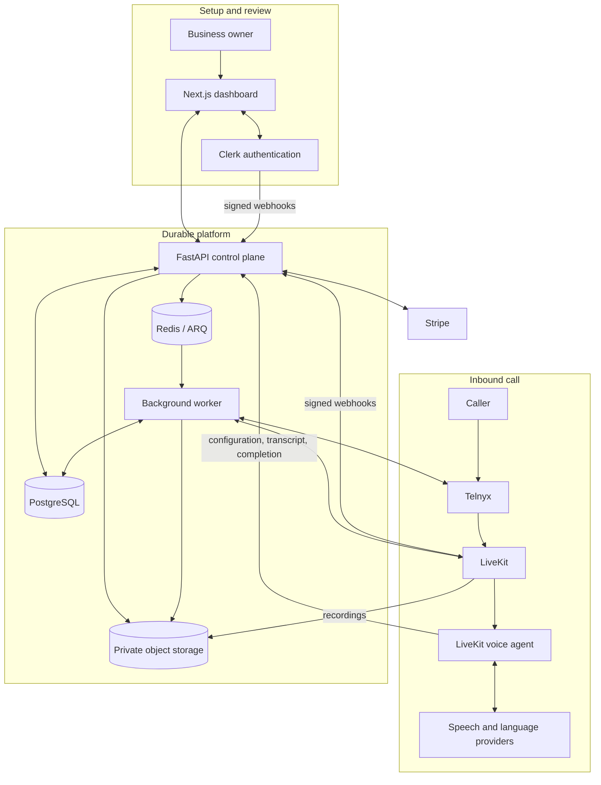

# General-Audience README Refresh Implementation Plan

> **For agentic workers:** REQUIRED SUB-SKILL: Use superpowers:subagent-driven-development (recommended) or superpowers:executing-plans to implement this plan task-by-task. Steps use checkbox (`- [ ]`) syntax for tracking.

**Goal:** Replace the detailed project README with a lighter, product-first document that accurately summarizes progress, shows two connected architecture journeys, and retains a reliable local quick start.

**Architecture:** `README.md` remains the concise public entry point, while `docs/PROJECT_STATUS.md` remains the canonical evidence and roadmap source. The Mermaid diagram connects owner setup and inbound calls through the shared FastAPI platform and shows the real worker, persistence, storage, and provider relationships without reproducing low-level lifecycle detail.

**Tech Stack:** GitHub-flavored Markdown, Mermaid, Docker Compose, existing project documentation

## Global Constraints

- Target approximately 100–130 lines in `README.md`.
- Keep the current product name during this documentation-only change; the broader Opevo-to-Opevo rename remains separate work.
- Keep `docs/dashboard.png` as the README screenshot.
- Treat `docs/PROJECT_STATUS.md` as canonical for status and roadmap claims.
- Preserve the current Docker Compose core-stack and disposable browser-proof commands.
- Do not inspect recursively, modify, delete, stage, or commit the user's untracked `Opevo_frontend/` directory.
- Do not modify the linked `feat/shadcn-activation-preview` worktree.

---

### Task 1: Rewrite and verify the public README

**Files:**
- Modify: `README.md`
- Reference: `docs/PROJECT_STATUS.md`
- Reference: `docs/superpowers/specs/2026-08-01-readme-refresh-design.md`
- Verify: `compose.dev.yaml`
- Verify: `docs/dashboard.png`

**Interfaces:**
- Consumes: the evidence-based status vocabulary and feature state in `docs/PROJECT_STATUS.md`; the local service names, ports, and modes in `compose.dev.yaml`
- Produces: a concise `README.md` with product overview, progress summary, connected Mermaid architecture, local quick start, technology table, and documentation links

- [ ] **Step 1: Confirm the change scope before editing**

Run:

```bash
git status --short --branch
test -f docs/dashboard.png
test -f docs/PROJECT_STATUS.md
docker compose -f compose.dev.yaml config --services
```

Expected: Git reports only the user's untracked `Opevo_frontend/` outside the committed planning documents; both referenced files exist; Compose lists `postgres`, `redis`, `minio`, `minio-init`, `migrate`, `api`, `worker`, `agent`, and `web`.

- [ ] **Step 2: Replace `README.md` with the approved concise content**

Write this exact document:

````markdown
# Opevo

> An open-source, France-first AI voice assistant for handling inbound business calls.

**Status:** Working MVP in active development. Locally verified, but not yet production-certified.


## What Opevo does

Opevo gives professionals and small businesses a configurable AI receptionist and a dedicated French phone number. It can:

- answer conditionally forwarded calls with business-specific context;
- manage subscriptions, number setup, forwarding verification, and go-live;
- preserve transcripts, summaries, private recordings, and minute usage; and
- provide a responsive dashboard for reviewing calls and configuring the assistant.

## Project progress

### Done

- Public landing page, authentication shell, and tenant-isolated dashboard
- Resumable local activation journey with fake billing and telephony providers
- Stripe billing and queued Telnyx number-provisioning integrations
- LiveKit voice-agent runtime with configurable speech and language providers
- Durable call lifecycle, transcripts, summaries, private recordings, and usage accounting
- Account deactivation/reactivation and owner-controlled terminal-call removal

### In progress

- Fresh real-provider certification across Clerk, Stripe, Telnyx, and LiveKit
- Cloud deployment, monitoring, backup restoration, and recovery evidence
- French localization plus approved legal, privacy, retention, and support pages
- Call tags and notes, accessibility conformance, and frontend performance gates

### Planned

- Account export, permanent deletion, and automatic retention
- Conversation-flow builder, tools, human transfer, and reusable subflows
- Calendar, CRM, and appointment-booking integrations
- Live monitoring and intervention, push delivery, and mobile experiences
- Additional countries and subscription plans after the France-first launch

See [Project Status and Roadmap](docs/PROJECT_STATUS.md) for the complete, evidence-based feature matrix and production gates.

## Architecture



The owner journey configures and reviews the service through the dashboard. The
call journey routes an inbound phone call through Telnyx and LiveKit to the
voice agent, which persists durable results through the API for later review.

## Run locally

### Prerequisites

- Docker with Docker Compose
- Node.js 22 only when running browser tests from the host

Start the provider-free development stack from the repository root:

```bash
docker compose -f compose.dev.yaml up --build postgres redis minio minio-init migrate api worker web
```

Open [http://127.0.0.1:3000/activate](http://127.0.0.1:3000/activate).
This path uses local identity and fake billing, carrier, telephony, and
verification providers, so hosted credentials are not required. It does not
start the LiveKit voice agent.

Run the disposable browser proof with:

```bash
npm exec --prefix apps/web -- playwright install chromium
bash scripts/run-local-e2e.sh
```

For real-provider configuration, follow the
[staging smoke runbook](docs/architecture/staging-smoke-runbook.md).

## Technology

| Area | Technology |
|---|---|
| Web | Next.js 16, React 19, TypeScript, Tailwind CSS 4, shadcn/ui |
| API | Python 3.13, FastAPI, SQLAlchemy, Alembic, Pydantic |
| Voice | LiveKit Agents, Speechmatics/Deepgram, Gemini, Speechmatics/ElevenLabs |
| Providers | Clerk, Stripe, Telnyx |
| Data and jobs | PostgreSQL, Redis, ARQ, S3-compatible object storage |
| Delivery | Docker Compose, GitHub Actions, OpenTelemetry, gitleaks, Trivy |

## Documentation

- [Detailed project status and roadmap](docs/PROJECT_STATUS.md)
- [Architecture and engineering context](docs/architecture/backend-context.md)
- [Integration endpoints](docs/architecture/integration-endpoints.md)
- [Contributing guide](CONTRIBUTING.md)
- [Security policy](SECURITY.md)

Opevo is available under the [MIT License](LICENSE).
````

- [ ] **Step 3: Verify length, required sections, and removed detail**

Run:

```bash
wc -l README.md
rg -n '^## (What Opevo does|Project progress|Architecture|Run locally|Technology|Documentation)$|^### (Done|In progress|Planned)$' README.md
rg -n 'Inbound call lifecycle|Engineering highlights|Repository structure|An authenticated owner can use' README.md
```

Expected: the README is approximately 100–130 lines; all nine required headings are present; the final search for removed detail returns no matches.

- [ ] **Step 4: Verify every local Markdown target and repository-sensitive command**

Run:

```bash
for target in docs/dashboard.png docs/PROJECT_STATUS.md docs/architecture/staging-smoke-runbook.md docs/architecture/backend-context.md docs/architecture/integration-endpoints.md CONTRIBUTING.md SECURITY.md LICENSE; do test -e "$target" || exit 1; done
docker compose -f compose.dev.yaml config --quiet
git diff --check
```

Expected: every linked local file exists, the Compose configuration is valid, and `git diff --check` prints nothing.

- [ ] **Step 5: Review factual claims against the canonical status document**

Compare every bullet under `Done`, `In progress`, and `Planned` with the corresponding rows in `docs/PROJECT_STATUS.md`. Confirm that `Done` is explicitly scoped to repository implementation and local verification, real providers remain under `In progress`, and production certification is not claimed.

- [ ] **Step 6: Review the rendered Markdown and architecture**

Open the README preview and confirm the screenshot renders, the three progress groups scan quickly, the Mermaid diagram has no isolated nodes, both journeys connect through `API`, and the local-development commands remain copyable.

- [ ] **Step 7: Commit the isolated README rewrite**

Run:

```bash
git add README.md
git commit -m "docs: simplify project readme"
```

Expected: the commit includes only `README.md`; `Opevo_frontend/` remains untracked and untouched.
